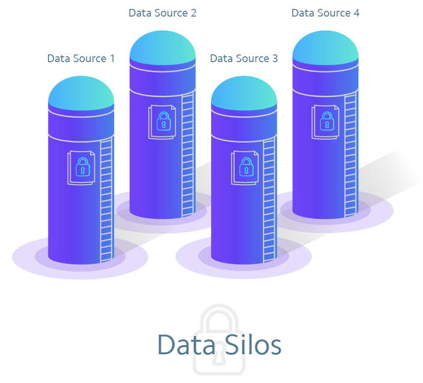

# Data Marketplace

**Data silos make it difficult to buy and sell data among different data points. To overcome this challenge, the Data Marketplace uses Masked Authenticated Messaging (MAM) channels to open up the data silos and allow users to make micropayments of IOTA tokens to the data owners in exchange for data.**

## Business case

Data is one of the most fundamental ingredients in the machine economy and the connected world. It is the foundation of the Data — Information — Knowledge — Wisdom [(DIKW) pyramid](https://en.wikipedia.org/wiki/DIKW_pyramid).

The different layers of this pyramid all rely on data. For example, sensors on cars can lead to the wisdom that allows drivers to bypass congestion:

- **Data:** Sensors monitor the road and receive signals from the photons that reflect off the surface of their environment
- **Information:** Sensor data is used to extract meaningful information about the speed of the moving objects and their relative positions
- **Knowledge:** Information is contextualized and distilled into knowledge, telling the drivers on the road via over-the-air ​updates that the road may be congested due to a crash
- **Wisdom:** Knowledge allows drivers to take an alternative route

Over the next decade, more than 75 billion connected devices will be interacting in different manners. These devices will give rise to a machine economy where they will trade everything from storage to electricity and sensor data. The data trade in this pilot project will highlight and explore the potential in these developments. With the prospect of tens of billions of devices generating data, we will see a proliferation of data that is unmatched in history.

## Challenges

The largest obstacle preventing the fulfillment of the grandeur envisaged by Big Data is the fact that the overwhelming majority of data remains locked in what is called data silos.

Data silos do not, or very rarely, share data outside their own closed environment. This environment leads to enormous quantities of wasted data. In fact, often, over 99% of data is lost to the void ([source: McKinsey 2015](https://www.mckinsey.com/mgi/overview/in-the-news/by-2025-internet-of-things-applications-could-have-11-trillion-impact)). This lost data could contain valuable information to any compensating party if it were in an open, decentralized data stream.

There are several reasons for the cumbersome and wasteful status quo. On the one hand, data wants to be free in the sense that its storage and transmission costs less and less over time. On the other hand, large quantities of data are extremely valuable and are not free to generate. These diametrically opposed conditions cause a gridlock that needs to be broken in order for Big Data to become truly big. A major cause of this is the fact that, while data sharing is becoming cheaper from a technological perspective, it is prohibitively expensive to sell fine, granular data in real-time due to intermediary fees — not to mention all the red tape one has to cut through in order to complete a single data purchase. These conditions make real-time data trade all but impossible. By 2025 it is projected that around 95% of all data will be generated by IoT devices in real-time ([source: IDC 2017](https://www.seagate.com/files/www-content/our-story/trends/files/idc-seagate-dataage-whitepaper.pdf)), so this is a pressing issue.

A third obstacle is the lack of ensured authenticity and audit trails of data. Before the adoption of distributed ledger technologies, data transmission protocols and databases were susceptible to various attacks, including middleman attacks and data tampering. Data is only as valuable as it is valid. In short, if the data input is garbage, the output will also be garbage.

## Solution

The IOTA Foundation launched the [Data Marketplace](https://data.iota.org) as a proof of concept (PoC) and as an open innovation ecosystem.

As a non-profit organisation, the IOTA Foundation has developed this project to produce an open source technology and to empower other organisations to shape their own IOTA-enabled data marketplaces, with associated products and services.

The growth of data marketplaces is an inevitable result of the IoT (Internet of Things) revolution. As physical assets such as ships, factories, vehicles, farms or buildings become digital, their digital twins will gradually act as secure data exchanges.

As data streams surge across silos and carry value across organisations, traditional value chains will transition into a web of value. This paradigm will be more complex to administer, forcing business to rethink their competitive play as part of these ecosystems. Data marketplaces will emerge as a means to exchange data, monetise data streams and provide the basis of new smart business models. We refer to this new wave of value creation, for the Internet of Everything, as the Economy of Things.

## Demo

See this website for a [demonstration of the application](https://data.iota.org/).

## Additional resources

---------------
#### Data Marketplace API documentation ####
[Link](https://data.iota.org/static/docs)

Interact with the Data Marketplace through the REST API.
---
#### GitHub repository ####
[Link](https://github.com/iotaledger/data-marketplace)

Read the code and some quickstart instructions to test this blueprint.
---
#### Core JavaScript client library ####
[Link](root://core/1.0/getting-started/get-started-js.md)

Learn how to use the iota.js client library to create, send, and receive transactions.
---
#### MAM eloquently explained ####
[Link](https://blog.iota.org/introducing-masked-authenticated-messaging-e55c1822d50e)

Masked Authenticated Messaging is a second layer data communication protocol that adds functionality to publish and control access to an encrypted data stream, over the Tangle. Learn more about how MAM works.
---
#### MAM GitHub repository ####
[Link](https://github.com/iotaledger/mam.client.js)

Read the code and some quickstart instructions to test MAM with JavaScript.
---------------
