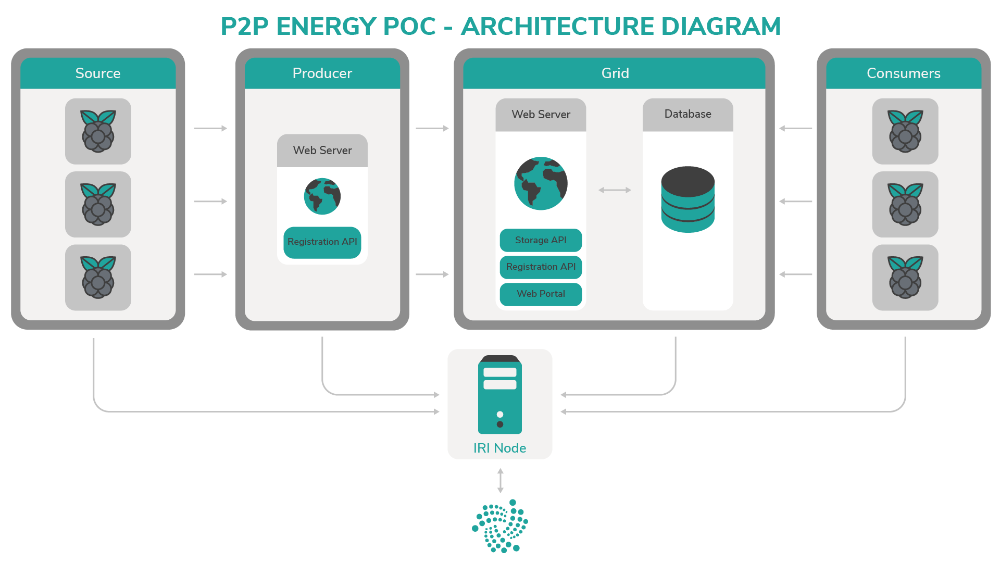
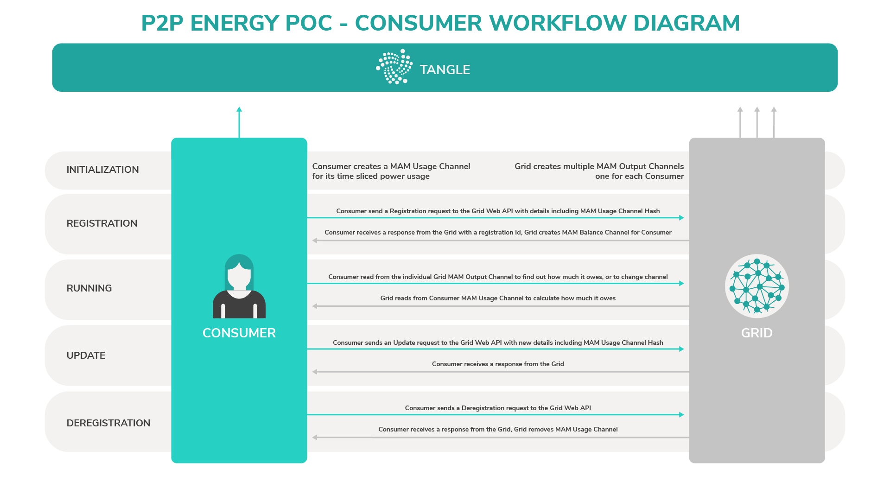
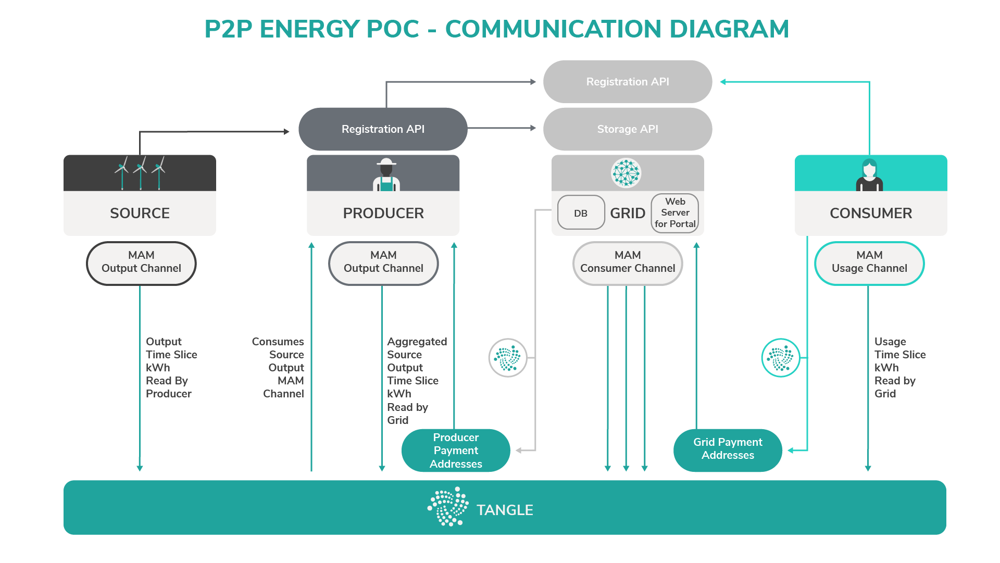

# Application architecture

**The P2P energy grid application publishes data from sources, producers, consumers, and the grid to MAM channels through a node in an IOTA network.**

:::warning:Disclaimer
Running an open source project, like any human endeavor, involves uncertainty and trade-offs. We hope the architecture described below helps you to deploy similar systems, but it may include mistakes, and can’t address every situation. If you have any questions about your project, we encourage you to do your own research, seek out experts, and discuss them with the IOTA community.
:::

The architecture of our PoC (shown in the image below) follows a pattern, where the source, producer, consumer, and grid are interconnected through an IOTA network.

IOTA technologies are advantageous in an architecture such as this as they allow entities to communicate with one another in a secure manner without needing to be always on or connected to each other.



IOTA technologies are employed as both the communication and payment mechanism between entities, which store the data on the Tangle.

The implementation of the source and the consumer is intended to be a lightweight operation that can be done by embedded devices. These entities need to perform Tangle operations, such as producing and consuming MAM channels, and communicating with web APIs. The producer is more complex and needs to host a web API to accept registrations, but can use the grid for any storage needs. Any more intense processes or storage requirements are offloaded to the grid.

This table displays a list of all the main components of the application:

**Component**|**Description**
:-----|:------|
Web Server: Storage API | Provides a facility for any entities within the system to store/retrieve arbitrary data, this allows any entities with limited storage facilities to store more data. The choice of a traditional web API instead of using the Tangle for storage is because the data on the Tangle can be removed at a snapshot.
--- | ---
Web Server: Registration API | The mechanism by which Sources register with producers, and consumers/producers register with the grid. This initial handshake must be performed using traditional web APIs as the MAM channel hashes need to be communicated along with any keys to the channel data.
Web Server: Web portal | A web UI that allows the grid to monitor the whole system.
Database | Provides a permanent storage mechanism for the grid to use for its own data.

The sources are kept as separate entities from the producers to allow for some redundancy. If a producer is offline, the sources continue logging their readings to the Tangle instead of directly to the producer. The sources are still registered with the producers so that the producers can later consolidate the data before communicating it to the grid.

The grid usually does the majority of the work, maintaining a database, running a web server with a portal, provisioning APIs, and running background tasks to process information. These operations could all be performed locally on the machine or outsourced to wider infrastructure in the cloud.

The grid maintains its own IRI node, which enables it to communicate with neighbours in the peer-to-peer network on which the Tangle operates. By running your own IRI node, the rest of the entities can live in a LAN network, with only the grid requiring WAN access to the rest of the Tangle for syncing. The alternative is for all entities to have WAN access directly to an IRI node on Tangle.

The following image shows the communication channels and the sequence of events that occur in the architecture.


## Workflows

The following workflows illustrate how the different entities interact with each other.

### Source to producer

This image shows the sequence of events that occur when a source communicates with a producer and the Tangle.


### Producer to grid

This image shows the sequence of events that occur when a producer communicates with the grid and the Tangle.


### Consumer to grid

This image shows the sequence of events that occur when a consumer communicates with the grid and the Tangle.



## Communication

The communication between the different entities is a combination of MAM channels and web API calls. MAM provides a mechanism by which the entities within the system can communicate in a secure fashion, also by publishing their data to the Tangle, the entities do not require a direct line of communication at all times.

A tangle transaction is issued whenever a consumer pays its bill to the grid or whenever the grid pays a producer.



### Source MAM output channel

The source creates a MAM channel to tell the producer how much it has contributed over a period of time. It's expected that on registration, the values in the payload will be monitored and recorded by the producer.

#### Payloads

```json
{
   "command": "output",        /* The MAM command */
   "startTime": 1542267468229, /* ms since 1900 */
   "endTime": 1542267469229,   /* ms since 1900 */
   "output": 1.234             /* kWh */
}
```

The source should publish an initial `hello` command to its channel so that the producer reading the channel can validate that it's subscribed to the correct channel.

```json
{
   "command": "hello"
}
```

On deregistration, the source should send a `goodbye` command to signal that the MAM channel is no longer used.

```json
{
   "command": "goodbye"
}
```

### Producer registration API

A source needs to be registered/deregistered with a producer so that the producer can read from the source's MAM channel. This can be achieved by using a lightweight web API on the producer.

#### Register

**PUT**

```
https://producer/registration/:registrationId
```

**Request**

```json
{
   "itemName"?: "My Solar Source",       /* free text */
   "itemType"?: "solar",                 /* free text */
   "root"?: "CCCCCC...DDDDDD",           /* Optional, MAM channel hash */
   "sideKey"?: "AAA....ZZZZZZ"           /* Optional, Side key to read MAM 
                                            channel */
}
```

**Response**

```json
{
   "success": true,                    /* true or false */
   "message": "OK"                     /* Or error message if fail */
}
```

When a source registers with a producer, it can start monitoring the source's MAM channel using the MAM channel details for its energy readings.

#### Deregister

```
DELETE https://producer/registration/:registrationId
```

**Response**

```json
{
   "success": true,                   /* true or false */
   "message": "OK"                    /* Or error message if fail */
}
```

When a source is deregistered, the producer should stop watching the source's MAM channel.

### Producer MAM output channel

This MAM channel contains information on the aggregated output from the producer's sources as a time period. Additionally, a proposed price for the power supplied and payment address is provided.

The grid will monitor and record the channels for all producers to use later in order to calculate the amount to pay to each producer. The payment address and requested  price can change per time period to give the Producer the ability to provide variable price power at different times.

The `askingPrice` field is not guaranteed to be met by the grid, instead a consensus price amongst all the producers will be paid. The consensus price could just be a regular average of all the `askingPrice` fields or a weighted average based on how much the producer contributed to the grid.

**Payload**

```json
{
   "command": "output",                /* The MAM command */
   "startTime": 1542267468229,         /* ms since 1900 */
   "endTime": 1542267469229,           /* ms since 1900 */
   "output": 1.234,                    /* kWh */
   "askingPrice": 56789,               /* IOTA per kWh */
   "paymentAddress": "PPPPPP...QQQQQQ" /* address to receive payment */
}
```

The producer payment addresses are where the grid sends payments. A producer can have more than one address as each time period in the producer's output channel can have a different address associated with it.

### Grid registration API

The grid registration API will take the form of a regular web API hosted on a web server. It is used by both the producers and consumers to register themselves with the grid. Once an entity is registered the grid will start monitoring their MAM output channels. On a successful registration an id is returned, this is then used in any future requests.

Both the registering entity and the grid should publish an initial `hello` command to their respective channels so that the entity reading the channel can validate that it's subscribed to the correct channel.

```json
{
   "command": "hello"
}
```

On unregistering both entities should send a `goodbye` command to signal that the MAM channel is no longer used.

```json
{
   "command": "goodbye"
}
```

For a consumer, the response will also return a MAM channel hash that the consumer should monitor for how much it owes the grid.

A description of the APIs is provided below.

#### Registration set

```
PUT https://grid/registration/:registrationId
```

**Request**

```json
{
   "itemName": "My Solar Source",         /* free text */
   "itemType": "producer",                /* enum producer/consumer */
   "root"?: "CCCCCC...DDDDDD",            /* MAM root hash for the channel 
                                             the grid should monitor, 
                                             optional as you may just want a  
                                             registration id */
   "sideKey"?: "CCC...DDDD"               /* side key for the channel,
                                             optional, as above */
}

**Response**

```json
{
   "success": true,                       /* true or false */
   "message": "OK",                       /* Or error message if fail */
   "root"?: "JJJJJJ...KKKKKK",            /* Optional, channel the
                                             registered item                
                                             should monitor from the grid.
                                             for the consumer this contains 
                                             the amount owed feed */
   "sideKey"?: "CCC...DDDD"               /* Optional, private key for the 
                                             channel */
}
```

#### Registration remove

```
DELETE https://grid/registration/:registration-id
```

**Response**

```json
{
   "success": true,     /* true or false */
   "message": "OK"      /* Or error message if fail */
}
```

### Grid storage API

The grid storage API is available to any part of the architecture that needs to store information on a permanent basis. The API will support the standard database CRUD operations and requires an entities registration id in all calls.

As the storage endpoint is permissionless any entity storing items in the grid that wants them to be private should encrypt them before storing.

The context parameter in all the calls is for use by any entity to partition data for its own purposes.

#### Set item

```
PUT https://grid/storage/item/:registration-id/:context/:id
```

**Request**

```json
{
   ...    /* free-form JSON data */
}
```

**Response**

```json
{
   "success": true,                 /* true or false */
   "message": "OK"                  /* Or error message if fail */
}
```

#### Get item

```
GET https://grid/storage/:registration-id/:context/:id
```

**Response**

```json
{
   "success": true,        /* true or false */
   "message": "OK",        /* Or error message if fail */
   "item": ...             /* free-form JSON data */
}
```

#### Delete item

By omitting the context or ID, you can remove whole folder structures.

```
DELETE https://grid/storage/:registration-id/:context?/:id?
```

**Response**

```json
{
   "success": true,           /* true or false */
   "message": "OK"            /* Or error message if fail */
}
```

#### Read all

Allows you to get items from the storage in a paged manner. Both page and page-size are optional and will default to 0 and 10 respectively.

```
GET https://grid/storage/:registration-id/:context?page?&page-size?
```

**Response**

```json
{
   "success": true,          /* true or false */
   "message": "OK",          /* Or error message if fail */
   "ids": [...],             /* array of the ids */
   "items": [...],           /* array of the items */
   "totalPages": 6,          /* calculated from page-size and num items */
   "totalItems": 45,         /* total number of items available */
   "pageSize": 10            /* The page size used in calculations */
}
```

#### Example

A producer with a registration ID of ABC123 might want to store the details of its sources in a safe place instead of just locally for backup.

It would create or update an item with a PUT to https://grid/storage/ABC123/sources/XXX123.

The item could be retrieved with a GET to https://grid/storage/ABC123/sources/XXX123

The item could be deleted with a DELETE to https://grid/storage/ABC123/sources/XXX123

Or all the items for ABC123 could be deleted with 
https://grid/storage/ABC123/

The producer could get all its items on page 5 with a page size of 10 with a GET call to https://grid/storage/ABC123/sources?page=5&pageSize=10

### Grid MAM consumer channels

When a consumer registers with the grid the grid will create a MAM channel that is updated with the consumers outstanding balance and also payment information. The grid will also track this information in its central DB but by providing a MAM channel a consumer can immediately see their outstanding balance. The outstanding balance is calculated from the information read from the consumers Usage Channel in conjunction with the pricing from the producer's output channels. The grid might also send command to the consumer through this channel.

#### Balance payload

```json
{
   "command": "balance",               /* the command */
   "owed": 345,                        /* amount in IOTA owed
                                          excludes pending transactions */
   "pending": 123,                     /* amount in IOTA
                                          of only pending transactions */
   "pendingTxs": ["TTTTT...UUUUUU"],   /* hashes of pending
                                          transactions*/
   "paymentAddress": "WWWWWW...XXXXXX" /* payment address for owed
                                          balance payment to grid */
}
```

The grid may need to change the consumer channel hash. To facilitate this, we can send a channel-change payload. On receipt of this payload, the source should stop using the current MAM channel and switch to the new one.

#### Channel update payload

```json
{
   "command": "channel-update",          /* the command */
   "root": "WWWWWW...XXXXXX",            /* the new channel the Consumer 
                                            should switch to */
   "sideKey": "CCC...DDDD"               /* private key for the channel */
}
```

### Grid payment addresses

The payment addresses are the ones published to the consumer's channels to receive payments. On receipt of payments the grid will update the consumer's channel, and again when payments confirm. After the grid has taken its cut of the IOTAs the rest will be added to a central pool which will be allocated to the producers based on time periods and asking prices.

### Consumer MAM usage channel

The consumer's MAM Usage Channel will be continuously updated with the consumer's usage based on time periods. The grid monitors the channel to calculate how much the consumer owes.

#### Payload

```json
{
   "startTime": 1542267468229,         /* ms since 1900 */
   "endTime": 1542267469229,           /* ms since 1900 */
   "usage": 1.234                      /* kWh */
}
```


