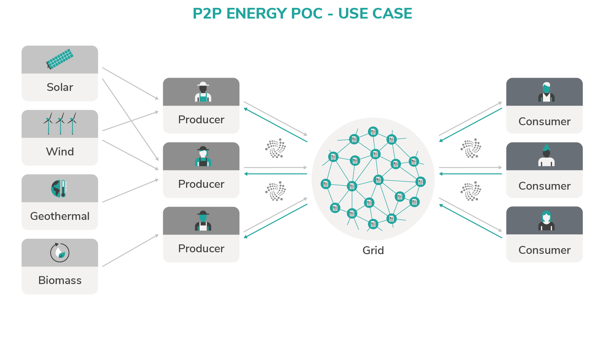

# Peer-to-peer energy grid

**Although the supply of energy is often automated, the payment system is expensive to integrate and often requires manual intervention. By creating a peer-to-peer (P2P) energy grid with IOTA, you can automate the transfer of power and the payment for that power. This automation makes your infrastructure more dynamic and easier to update.**

This blueprint demonstrates how entities in a P2P energy grid can trade energy. The distributed and machine-based nature of the P2P energy grid make this an ideal use case for IOTA. Using IOTA technologies, you can create an infrastructure where even low-powered devices can communicate with the grid in a traceable and immutable way.

Trading energy on a P2P energy grid involves four high-level entities:

**Entity** | **Role**
---|---
**Source**|Generate electricity such as solar or wind for a producer|
**Producer**| Manage several sources and receive payment from the grid
**Consumer** |Use the power provided by the grid in return for payment|
**Grid**| Coordinate the distribution of power from the producers to the consumers, and distribute payments|
 

:::info:
This blueprint can be replicated in any scenario where a resource is distributed to consumers in return for payment, for example water supply.

The full deployment instructions for this blueprint will be available in May.
:::

## Additional resources

---------------
#### iota.js client library ####
[Link](root://iota-js/0.1/README.md)

Learn how to use the iota.js client library to create, send, and receive transactions.
---
#### MAM eloquently explained ####
[Link](https://blog.iota.org/introducing-masked-authenticated-messaging-e55c1822d50e)

Masked Authenticated Messaging is a second layer data communication protocol that adds functionality to publish and control access to an encrypted data stream, over the Tangle. Learn more about how MAM works.
---
#### MAM GitHub repository ####
[Link](https://github.com/iotaledger/mam.client.js)

Read the code and some quickstart instructions to test MAM with JavaScript.
---------------

