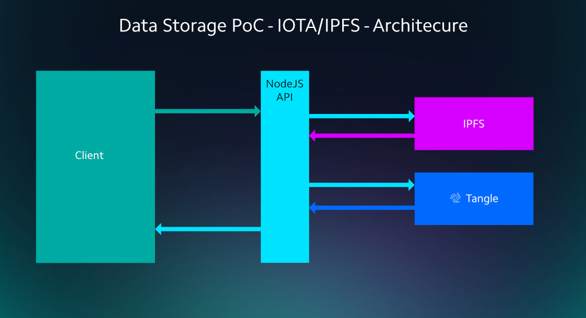

# Application architecture

**The Tangle data storage application consists of two parts: A graphical user interface (GUI) written in React and a back-end API written in NodeJS.**

:::warning:Disclaimer
Running an open source project, like any human endeavor, involves uncertainty and trade-offs. We hope the architecture described below helps you to deploy similar systems, but it may include mistakes, and can’t address every situation. If you have any questions about your project, we encourage you to do your own research, seek out experts, and discuss them with the IOTA community.
:::

This blueprint uses the following architecture whereby clients upload files to the API server, which sends the files to an InterPlanetary File System (IPFS) node and attaches the IPFS hashes to transactions on the Tangle.



## Building blocks

The API server exposes two methods to the client:

- `storeFile()`
- `retrieveFile()`
  
## storeFile()

To store a file using the API, the client does the following:

- Select the file to upload
- Generate SHA256 hash of the file content
- Capture additional file metadata

Behind the scenes, the API does the following:

- Upload the file content to IPFS, which returns the IPFS hash
- Attach the file metadata, SHA256 hash, and IPFS hash to the Tangle in a transaction, and return the transaction hash to the client


### Uploading file content to the IPFS

The `storeFile()` method takes a JSON object in the following format:

```javascript
IPFSStoreRequest {
   /**
    * The name of the file
    */
   name: string;

   /**
    * The description of the file
    */
   description: string;

   /**
    * The size of the file
    */
   size: number;

   /**
    * The modified date of the file
    */
   modified: Date;

   /**
    * The sha256 hash of the file
    */
   sha256: string;

   /**
    * The file data encoded in base64
    */
   data: string;
}
```

On receipt of the JSON object, the file data is uploaded to the IPFS node.

```javascript
import ipfsClient from "ipfs-http-client";

const buffer = Buffer.from(request.data, "base64");
const ipfs = ipfsClient(config.ipfs);
const addResponse = await ipfs.add(buffer);
```

### Attaching the file data to the Tangle

The `add()` method returns the IPFS hash, which is combined with the other data in the JSON object before being attached to the Tangle in a transaction.

```javascript
// Generate a new address
const nextAddress = generateAddress(config.seed, 0, 2);

// Define the message to add to the transaction
const tanglePayload = {
   name: request.name,
   description: request.description,
   size: request.size,
   modified: request.modified,
   sha256: request.sha256,
   ipfs: addResponse[0].hash
};

// Connect to an IOTA node
const iota = composeAPI({
        provider: config.provider
    });

// Create a bundle
const trytes = await iota.prepareTransfers(
   // Here, we use a seed that consists of all 9s.
   // This is because the seed is not used to sign the transaction.
   "9".repeat(81),
   [
	   {
		   address: nextAddress,
		   value: 0,
		   message: TrytesHelper.toTrytes(tanglePayload)
	   }
   ]);

// Send the transaction to the Tangle
const bundle = await iota.sendTrytes(trytes, config.depth, config.mwm);
```

The bundle returned from the `sendTrytes()` method contains the transaction hash, which is returned to the client to use for reading the data on the Tangle.

## retrieveFile()

To retrieve a file and validate its contents, the client does the following:

- Get the file data from the Tangle, using the transaction hash
- Get the file contents from IPFS using the returned IPFS hash
- Perform a SHA256 hash on the file data, and compare the calculated SHA256 with the one returned from the Tangle


### Getting the file data from the Tangle

To get the file data from the Tangle, we request the transaction from the IOTA node, using the transaction hash.

```javascript
// Connect to an IOTA node
const iota = composeAPI({
        provider: config.provider
    });

// Get the transaction trytes for the transaction with the specified hash
const transactions = await iota.getTrytes([request.transactionHash]);
// Convert the transaction trytes to an object
const txObject = asTransactionObject(transactions[0]);
// Get the message and convert it to ASCII characters
const ascii = trytesToAscii(txObject.signatureMessageFragment);
// Parse the JSON message
const payload = JSON.parse(ascii)
```

### Getting the file data from the IPFS

The transaction hash is used to request the file from the IPFS node, using a public IPFS gateway such as [Cloudflare](https://cloudflare-ipfs.com/ipfs/).

### Comparing the data

Assuming the file was returned from the IPFS into a buffer, the file is hashed using a SHA256 algorithm and the resulting hash is compared to the one from the transaction's `signatureMessageFragment` field.

```javascript
const sha256 = crypto.createHash("sha256");
sha256.update(fileBuffer);
const ipfsSha256 = sha256.digest("hex");
if (ipfsSha256 === payload.sha256) {
   console.log("All Is Well");
} else {
   console.log("Oh no, the hash does not match");
}
```

## Customization considerations

If you want to use this blueprint in your own system, you should consider the following.

### Data security

Because the IPFS is a distributed web, anyone who has the IPFS hash can download and read the contents of the file. 

To prevent unauthorized entities from reading the data, you could encrypt it before uploading it to the IPFS node.

### Alternative data storage solutions

In this application, data is uploaded to an IPFS node, however the same principles apply if you were to upload to an alternative data storage solution.

To use alternative storage solutions such as Amazon S3 or Azure Storage, you just need to upload the data to it with a unique hash (for example the SHA256 hash of the file).
