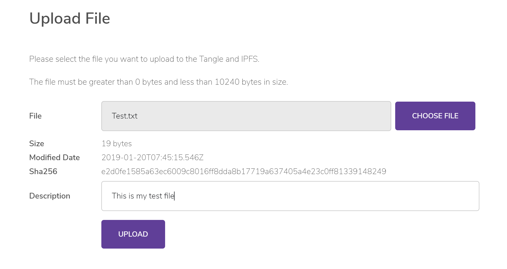

# Deploy and test the Tangle data storage demo

**To start storing data in the IPFS node and the Tangle, deploy the application and use our graphical user interface to upload file data, retrieve file data, and compare hashes to verify the contents.**

## Prerequisites

To test and deploy this application, you need the following:

- Node.js installed on your device
- A database on [Amazon DynamoDB](https://aws.amazon.com/dynamodb/)
- An [IPFS node](https://docs.ipfs.io/introduction/overview/)

To edit this application for your own needs, you need knowledge of JavaScript, Node.js, and React.js.

## Deploy the Tangle data storage app

To deploy this application on your local network, complete the following instructions. These deployment instructions are also hosted on [GitHub](https://github.com/iotaledger/poc-ipfs/blob/master/README.md).

1. Clone the GitHub repository

    ```bash
    git clone https://github.com/iotaledger/poc-ipfs.git
    cd poc-ipfs
    ```

2. Change into the `api` directory and install the dependencies

    ```bash
    cd api
    npm i
    ```

3. Copy the `src/data/config.template.json` file to the `dist/data` directory and rename it to `config.local.json`

4. Open the `config.local.json` file and configure the API server

    |**Configuration option**|**Description**|**Notes**|
    |:---|:-----|:----|
    |`node` (required)|Set the `provider` field to the URL of an IOTA node. Set the `depth` field to a valid [depth](root://getting-started/0.1/transactions/depth.md), and the `mwm` field to a valid [minimum weight magnitude](root://getting-started/0.1/network/minimum-weight-magnitude.md).|When choosing a node, consider the [IOTA network](root://getting-started/0.1/network/iota-networks.md) that you want to use|
    |`ipfs` (required)|Set the `provider` field to the URL of your IPFS node. If your IPFS node requires an authentication token, set this in the `token` field.||
    |`dynamoDbConnection` (required)| Set these fields to the settings for your DynamoDB instance|This database is needed to keep track of transaction data so that it is never lost on the Tangle after a snapshot|
    |`allowedDomains`| Set this field to the domains that may access the API.||

5. From the `api` directory, start the API server in development mode

    ```bash
    npm run start-dev
    ```

6. Change into the `client` directory and install the dependencies

    ```bash
    cd ../client
    npm i
    ```

7. Rename the `public/data/config.template.json` file to `config.local.json`

8. Open the `config.local.json` file and configure the client application

    |**Configuration option**|**Description**|**Notes**|
    |:---|:-----|:----|
    |`apiEndpoint` (required)|Set this field to the URL of the API server that you just started|By default, the API listens on the following URL: `http:localhost:4000`|
    |`ipfsGateway`|Set this field to the IPFS gateway that you want to use to get files from the IPFS network|The default gateway is `https://ipfs.io/ipfs/:hash`|
    |`tangleExplorer`| Set these fields to the URL of the Tangle explorer that you want to use to search for transactions and bundles on the front end|The default Tangle explorer is `https://utils.iota.org`|
    |`googleAnalyticsId`| If you have Google Analytics set up for your client, set this field to your Google Analytics ID||

9. Run the client application

    ```bash
    npm run start
    ```

When the client connects to the API, the following page will be opened in your default web browser:


:::info:
The file size limitation is only for the purposes of this blueprint. You can edit this blueprint to allow any file size.
:::

This page is the front end to the application, which you can use to test it.

## Test the Tangle data storage app

1. Select a file, and see that the other fields are automatically populated with metadata

    

2. Click **Upload** to store the metadata on the IPFS node and the Tangle. If everything went well, you should see a confirmation message.

    

3. To validate a file, go to the Retrieve File page.

    

4. Enter a transaction hash and click **RETRIEVE**. The transaction hash will be passed to the API, which will get the IPFS hash from the transaction's `signatureMessageFragment` field, which is used to download the file and validate its SHA256 hash against the one stored in the transaction.

    

This completes the full lifecycle for storing, retrieving, and validating a file. The file metadata, SHA256 hash and IPFS hash that are stored in a transaction on the Tangle are immutable. If the file contents that you retrieve from the IPFS node don't match the ones on the Tangle, then the contents of that file can no longer be trusted.

## Next steps

Try [running your own IRI node](root://node-software/0.1/iri/how-to-guides/quickstart.md) and configuring the application to connect to it.
