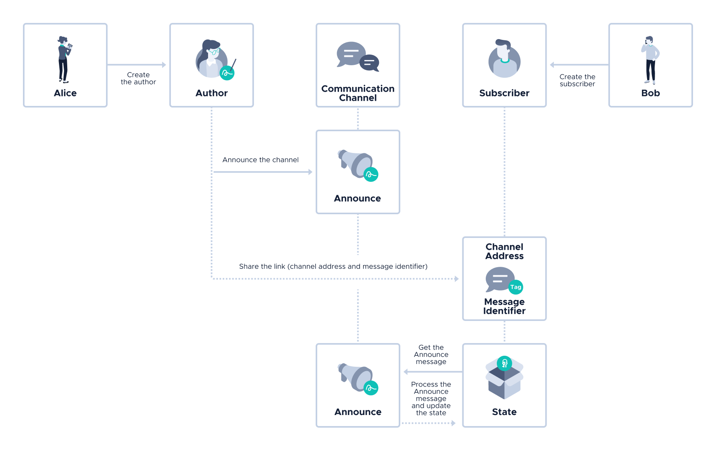
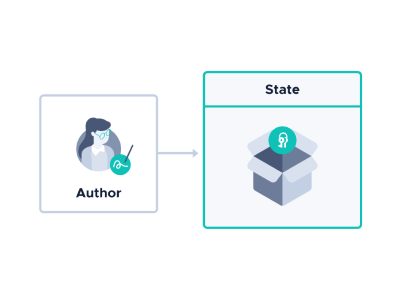

# How Channels works

**Channels is a built-in [Streams](root://iota-streams/1.0/overview.md) protocol for building secure messaging applications that have a single owner and one or more subscribers. Messages can be published on any communication channel, which includes the Tangle as a default.**

## Roles

Each channel has **one owner, called the author** who is responsible for creating it by publishing an [`Announce`](#message-types) message on a communication channel.
​
Once the author has created a channel, **one or more subscribers** can communicate asynchronously with both each other and the author by publishing messages on it.

## Communication channels and links

Messages can be published on any communication channel such as HTTP and addressed by a link.

The link consists of the channel address and the message identifier, which are both used to find messages on the channel.

The channel address is what identifies a channel. Each message in the same channel has the same channel address, which is generated from the author's [signature keys](#signature-keys). This allows the author to sign messages and prove ownership of the channel.

The message identifier differentiates individual messages on a channel.

### Link types

Links can be of many types, depending on the communication channel. For example, for HTTP, the link type could be a URL.

By default, Channels comes with an API for publishing messages in the Tangle and addressing them by an `Address` link type.

The `Address` link type includes the channel address in the [`address`](root://getting-started/1.1/references/transaction-fields.md) field of a transaction and the message identifier in the `tag` field.

## Linking messages to others

So that receivers know whether they are processing messages in the correct order, all messages, except the `Announce` message (the first message in a channel), must be linked to another through its message identifier.

These links add a dependency to the message. For example, to allow subscribers to verify a signature in a message, that message relies on another that contains the public key. In this case, you could link the signed message to the one that contains the public key.

By linking messages in this way, you can also fork the channel into many directions, depending on the use case.

See [Designing the messaging workflow](guides/designing-the-workflow.md) for more information.

## Messages

The contents of each message is defined by its [type](#message-types), which contains information about how it should be cryptographically processed.

For example, an author's message may contain a masked payload as well as a signature. This content must be processed in a specific way that allows subscribers to decrypt it and verify the signature.

## Message types

Messages can be one of seven types, which can be created and published only by users with particular roles.

### Managing a channel's keys as an author

The following message types are used by the author to manage the keys to a channel:

|**Message type**| **Description**| **How and when it's used**|
|:-----------|:-----------|:---------------------------------------|
|| Starts the channel by publishing the author's public [signature key](#signature-keys) and optional public [encryption key](#encryption-keys) | Subscribers use the public signature key to verify signatures in `SignedPacket` and `ChangeKey` messages. Subscribers can also use the public encryption key to encrypt their own encryption keys and publish them in `Subscribe` messages.|
|| Publishes a new [public signature key](#author) and authenticates it with the previous private key| When the author runs out of one-time signature keys and wants to continue signing messages on the same channel instead of starting a new one|
|| Publishes a session key that's encrypted with the public encryption keys of authorized subscribers|Gives authorized subscribers access to decrypt the author's masked payloads in `SignedPacket` and `TaggedPacket` messages and to publish their own masked payloads in `TaggedPacket` messages|

### Managing subscriptions to masked payloads as a subscriber

The following message types are used by subscribers to communicate with the author about access to masked payloads:

|**Message type**| **Description**|  **How and when it's used**|
|:-----------|:-----------|:---------------------------------------|
||Encrypts the subscriber's public encryption key with the author's public encryption key and publishes it| Keeps subscribers anonymous and allows the author to decrypt their public encryption keys to use them to generate and publish session keys in  `Keyload` messages
|| Publishes the subscriber's intent to unsubscribe from the channel|Allows the author to generate future session keys that don't include that subscriber's key, saving computational power

### Publishing signed data as an author

The following message type is used by the author to publish public or masked payloads that are signed:

|**Message type**| **Description**|  **How and when it's used**|
|:-----------|:-----------|:---------------------------------------|
||Publishes a signed payload that can be public and/or masked | The signature is used to prove the identity of the author|

### Publishing anonymous data as an author or subscriber

|**Message type**| **Description**|  **How and when it's used**|
|:-----------|:-----------|:---------------------------------------|
|| Publishes public and masked payloads that are authenticated with a [message authentication code](https://searchsecurity.techtarget.com/definition/message-authentication-code-MAC). |The MAC code is used to prove that the message is unchanged. These messages are anonymous, unless the author publishes a `SignedPacket` message and links it to one of them|

## States

Each message contains important information that may be necessary to process future messages.

Therefore, the author and subscribers store this information in their local states.

For both the author and subscribers, the state contains references to the messages that have already been processed as well as the cryptographic result of processed messages, which is called the spongos state.

An author's state may also include:

- A private [signature key](#signature-keys), which is used to sign a message
- A private [encryption key](#encryption-keys), which is used by subscribers to create `Subscribe` messages
- The encryption keys of any trusted subscribers. These keys are used to create `Keyload` messages.

A subscriber's state may include:

- A private encryption key, which is used to process `Keyload` messages
- The author's public encryption key, which may be used when creating `Keyload` and `Subscribe` messages
- The author's current public signature key, which is used to verify signatures in signed messages

:::info:
The author's signature keys can be changed in `ChangeKey` messages.
:::

## Encryption keys

To encrypt masked payloads, the author uses a session key. This key is encrypted with the authorized subscribers' public encryption keys and published in a `Keyload` message for them to decrypt and use.

Subscribers can have one of the following encryption keys:

- A pre-shared key
- An NTRU key pair

The author may also have an optional NTRU key pair, which allows subscribers to publish `Subscribe` messages.

The way in which the author can get the subsribers' keys depends on the messaging workflow. See [Getting the public encryption keys of subscribers](guides/designing-the-workflow.md#getting-the-public-encryption-keys-of-subscribers) for more information.

## Signature keys

Only authors have signature keys to sign messages and prove ownership of the channel.
​
To sign messages, the author uses a [Merkle signature scheme (MSS)](https://en.wikipedia.org/wiki/Merkle_signature_scheme). This signature scheme uses a pseudo-random number generator and a secret string to generate [Winternitz one-time signature keys](https://en.wikipedia.org/wiki/Hash-based_cryptography#One-time_signature_schemes). These signatures are quantum robust, meaning that they are resistant against attacks by quantum computers. However, the 'one-time' part, means that each private key can be used only once. Therefore, authors need to decide in advance how many private keys to pre-generate because the public half of these keys is then used to generate the channel address, which is also the Merkle root.
​

To verify signatures, subscribers use the author's public signature key from either an `Announce` message or a `ChangeKey` message.

## Processing messages

The author and subscribers process messages according to their [type](#message-types), using a corresponding `unwrap()` method.
​
The `unwrap()` method uses the author's or subscriber's state to process a message and extract the message's content.
​
For example, when a subscriber processes a `Keyload` message, the `unwrap_keyload()` method uses the subscriber's state to decrypt the session key. Then, the result of processing the `Keyload` message would be added to the subscriber's spongos state, which can be used to decrypt payloads in future `TaggedPacket` and `SignedPacket` messages.
​
## Next steps
​
[Design your own messaging workflow](guides/designing-the-workflow.md).