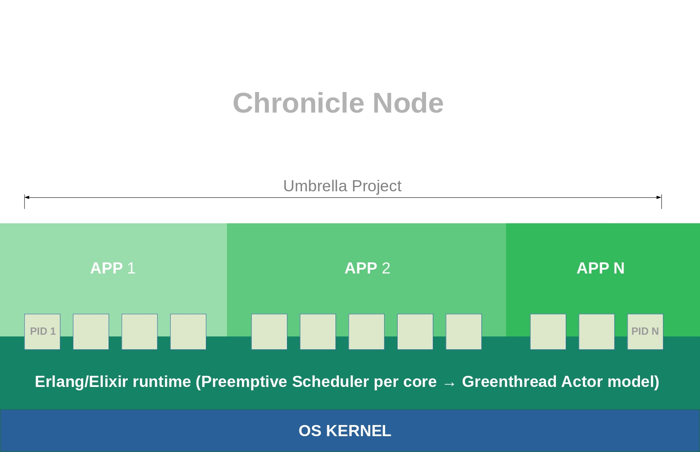

# How Chronicle works

**Chronicle receives transactions from nodes through the `trytes` [ZMQ event](root://iri/1.0/references/zmq-events.md). When Chronicle receives transactions, it stores them in a [Scylla database](https://www.scylladb.com/).**

## Architecture

One Chronicle node manages and supervises all the shards in a Scylla swarm. It does this by establishing at least one independent connection to each shard, which is supervised by the core app in the umbrella project.

In this diagram, the Chronicle node consists of the green components between the IRI node and the Scylla swarm. The node contains the umbrella project, API services, the core app, the ZMQ messenger, and the explorer service.

### Umbrella project

An Umbrella project is a space where independent apps coexist and communicate through Inter-Process Communication (IPC). Each app runs under its own supervision tree, which allows it to grow and easily migrate to its own rack (a cluster with its own umbrella project).

To allow Chronicle to scale up, it uses Elixir [umbrella projects](https://elixir-lang.org/getting-started/mix-otp/dependencies-and-umbrella-projects.html#umbrella-projects) to split code into multiple apps and arrange them under an umbrella project.

The Chronicle umbrella project includes a core app that communicates with the Scylla swarm to do the following:

- Manage database changes
- Forward the changes to the swarm
- Monitor cluster supervisors

Other apps use the core app to communicate with the Scylla swarm through IPC. These apps can hold the business rules that need to interact with the core app.

Apps take turns to run by using a preemptive scheduling process that's based on a round-robin algorithm.

### Core app

The Chronicle core app may be an independent microservice or it may be dependent on other apps. For example, a Chronicle app may depend on the shared core app to access the Tangle.

