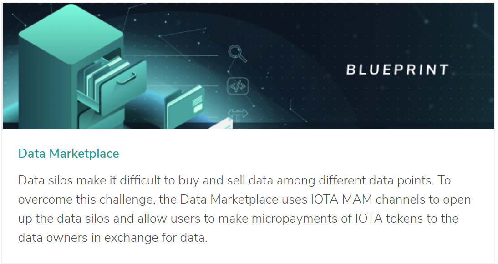
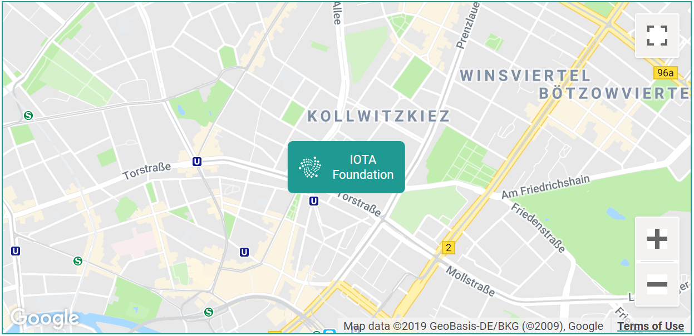
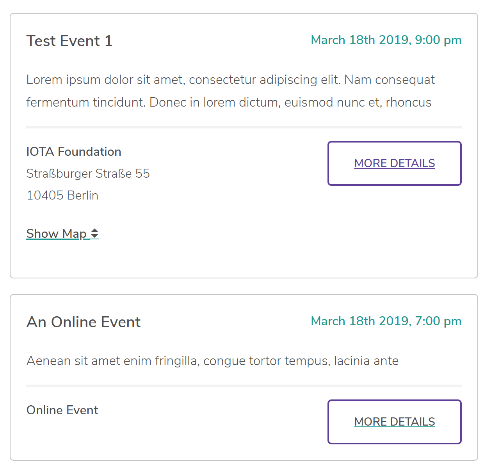

# Documentation style guide

We encourage everyone with knowledge of IOTA technology to contribute to our documentation.

To contribute new content:

1. See our [open issues](https://github.com/iotaledger/documentation/issues)
2. Choose something that you'd like to work on, or create a new issue to suggest new content
3. [Set up GitHub](#set-up-github)
4. Comment on the issue to let us know that you'd like to work on it
5. Start writing your content, following our [style guide](#writing-guide)
6. [Push your content to our GitHub repository](#push-content-to-our-github-repository)

To make suggestions to existing content:

1. [Set up GitHub](#set-up-github)
2. Find the article that you want to change
3. Start making your changes, following our [style guide](#style-guide)
4. [Push your content to our GitHub repository](#push-content-to-our-github-repository)

Thanks! :heart:

## Do you have a question?

If you have a general or technical question, you can use one of the following resources instead of submitting an issue:

- [**Discord:**](https://discord.iota.org/) For communicating with the developers and community members
- [**IOTA cafe:**](https://iota.cafe/) For discussing technical questions with the Research Department at the IOTA Foundation
- [**StackExchange:**](https://iota.stackexchange.com/) For asking technical questions

## Set up GitHub

Our documentation is hosted on GitHub, which is a version control tool. To create new content, or suggest changes to existing content, you must use Git or GitHub.

If you already have a GitHub account and Git is set up on your computer, go straight to [Create a new branch](#create-a-new-branch).

1. [Create a new GitHub account](https://github.com/) if you don't already have one
2. [Set up Git](https://help.github.com/articles/set-up-git/)
3. Go to our [documentation repository](https://github.com/iotaledger/documentation.git) and click **Fork** at the top of the page
4. Copy your fork to your local machine by doing the following in a command-line interface:

    ```bash
    git clone https://github.com/{your username}/documentation
    ```

5. Create a reference to the root repository by doing the following:

    ```bash
    cd documentation
    git remote add upstream https://github.com/iotaledger/documentation.git
    git fetch upstream
    ```

Now, your `documentation` directory will contain all the documentation files.

### Create a new branch

Branches help us to review content by separating contributions.

When you create a new branch make sure each branch addresses only one article to make it easy for us to add your changes. The following types of contribution are appropriate for a new branch:

- A new article ( a single markdown file)
- Grammar edits and spelling corrections, and any other suggestions for an existing article

1. Open a command-line interface

2. Do the following:

    ```bash
    git pull upstream develop:<your branch name>
    git push origin <your branch name>
    ```

3. To start working on your local copy of the branch, do the following:

    ```bash
    git checkout <your branch name>
    ```

Please follow our [style guide](#style-guide) when you write and edit articles.

### Push content to our GitHub repository

After writing or editing content in your local copy of the branch, the next step is to push them to our repository.

1. Add your changes

    ```bash
    git add .
    ```
    
    :::info:
    You may be asked to set your account's default identity.
    :::
  
    ```bash
    Please tell me who you are
    Run 
    git config --global user.email "you@example.com"
    git config --global user.name "Your Name"
    ```
    
2. Commit your changes

    ```bash
    git commit -m "<Describe the changes you made>"
    ```

    :::info:
    When you commit your changes, a script will start [validating your content](#validation-script) to make sure that no links are broken and to look for spelling mistakes.
    :::
    
    :::info:
    Make any additional changes to the same files in subsequent commits as you work. Not all changes need to be in the same commit.
    :::

3. Push your changes

    ```bash
    git push origin <your branch name>
    ```
    
4. In GitHub, go to the repository that you forked from `iotaledger/documentation`, and click **Pull Request** at the top of the page

5. Make sure that the base branch is `iotaledger/documentation@develop` and the head branch is `<your username>/documentation@<your branch name>`

6. Click **Update Commit Range** or **Compare & pull request**

7. Give your pull request a title, and describe all the changes you're making

8. Click **Submit**

:::success:
Thank you! We will now process your pull request. If there are any edits to make, we will ask you in the comments of the pull request you created.
::: 

You can continue working and commit/push new changes like you did before. Any updates will appear in the pending pull request.

### Validation script

If you make changes to this repository you should run the validation script before commiting any content.

To validate the content, first make sure you have installed the dependencies with `npm install`, then run the following script:

```shell
node buildProjects
```

This script will do the following:

- Print errors to the console
- Create a `projects-summary.log` file, which shows the structure of the content and also highlights the errors
- Create a spelling-summary.md file, which contains any possible spelling mistakes and suggestions

The spell checker uses [Hunspell](https://en.wikipedia.org/wiki/Hunspell) behind the scenes.

To enhance the spell checker, you can add words to the dictionary.json file, which supports regular expressions. For example:

```json
{
    "global": [
        "(P|p)ermission(less|ed)"
    ],
    "smartcity": [
        "AstroPi"
    ]
}
```

If you want to validate just a single project you can run the script with a command-line option of the specific folder name. For example, to validate only the content in the `getting-started` directory:

```shell
node buildProjects getting-started
```

## Structure

The content in the `documentation` directory is structured in a way that allows us to render it on a webpage.

### Top level navigation

The `projects.md` file contains the top level navigation labels and links for the following:

- Home page floating menu
- Footer
- Burger menu navigation

The order of the items in the file determines the order in the navigation.

:::info:
An item will appear in the navigation only if the corresponding sub-directory for that project also contains a `home.md` file. The links must be relative to the location of the `projects.md` file.
:::

The content of the file is a list of markdown links.

### Home page

The `home.md` file of a project contains the content to display on the home page. The file contains a level 1 heading, which determines the description for that section. In addition there are links followed by level 2 header which contain the direct links into the content.

The links must be relative to the location of the `home.md` file.

### Version directories

Under each project directory is another directory that's named after the version number for the content. If more than one version directory exists, the version selector will be displayed. This version selector allows the reader to choose which version of the content they want to see.

Each version directory contains all of the content required for that project version as well as a `doc-index.md` file, which contains the items that you want to appear in the left navigation panel.

The links must be relative to the `doc-index.md` file.

If you want to link to another project, use the following structure `root://another-project/0.1/some-content.md`.

## Style guide

If you are creating or editing an article, please follow our style guide to help us do the following:

- Create and maintain a consistent tone of voice 
- Offer documentation in a standard format
- Make our documentation straightforward to read for non-native English readers
- Make sure that our documentation educates our readers

If you have a question about writing that we don't cover in this guide, use the [Google style guide](https://developers.google.com/style/).

### Markdown

We use an enhanced version of markdown for our documentation. Please refer to these [tips](https://github.com/adam-p/markdown-here/wiki/Markdown-Cheatsheet) if you haven't used markdown before.

#### Tabbed controls

Tabbed controls are useful for creating content for different users or use cases such as multiple code samples.

To create tabbed code samples, use the following syntax:

```markdown
--------------------
### Tab Page 1
This is the content in tab page 1.
---
### Tab Page 2
This is the content in tab page 2.
--------------------
```

:::info:
The h3 heading is the tab label.
:::


#### Cards

Cards are useful for project landing pages, where you need to list more than one type or category.

To create a card, use the following syntax:

```markdown
-------------------------
Image
## Title with link to file
Data silos make it difficult to buy and sell data among different data points. To overcome this challenge, the Data Marketplace uses IOTA MAM channels to open up the data silos and allow users to make micropayments of IOTA tokens to the data owners in exchange for data.
-------------------------
```



#### Colored headings

Colored headings are useful for showing a clearer distinction between to different headings.

To create a colored heading, use the following syntax:

```markdown
### **OFFICIAL SUPPORT** ###

### __COMMUNITY SUPPORT__ ###
```


#### Colored bullets

Colored bullets are useful for listing content under colored headings.

To create a colored bullet, use the following syntax:

```markdown
---------------
#### **JavaScript Library** ####
Link to file

Excepteur sint occaecat cupidatat non proident, sunt in culpa qui.
---
#### __Go Library__ ####
Excepteur sint occaecat cupidatat non proident, sunt in culpa qui.
---
#### Python Library ####
Excepteur sint occaecat cupidatat non proident, sunt in culpa qui.
---------------
```


#### Emoji

Using an emoji in your content can help to engage the reader.

:::warning:
Certain emoji have different meanings in different cultures. For example, in Brazil the OK symbol :ok_hand: is considered rude, and in the Middle East, so is the thumbs-up symbol :+1:.
:::

To create an emoji, use the following syntax:

```markdown
:smile:
:laughing:
```


For a list of available emoji, see this JSON file: [https://github.com/muan/emojilib/blob/master/emojis.json](https://github.com/muan/emojilib/blob/master/emojis.json)

#### Google maps

A Google map can be embedded in your content by surrounding it with `¬¬¬` fencing. You can then specify the type as `[map]` and provide the JSON configuration for the object as follows:

```markdown
¬¬¬
[map]
{
    "zoom":14,
    "center": {
        "lat": 52.5294498,
        "lng": 13.412903
    },
    "markers": [
        {
            "name": "IOTA Foundation",
            "lat": 52.5294498,
            "lng": 13.412903
        }
    ]
}
¬¬¬
```



#### Data feeds

A feed can be embedded in your content by surrounding it with `¬¬¬` fencing. You can then specify the type as `[feed]` and provide the JSON configuration for the object as follows:

```markdown
¬¬¬
[feed]
{
    "displayType": "event",
    "context": "training"
}
¬¬¬
```

The `displayType` field specifies how the content will be rendered on the page and the `context` field is used to determine where the data is retrieved from using the documentation api e.g. `https://docs-api.iota.org/feed/training`. The feeds list supports paging and will show it when necessary. The table of contents for the page is dynamically generated from any h2 headers in the rendered items.



### Message boxes

Message boxes are useful for bringing attention to certain information.

To create a message box, use the following syntax:

```markdown
:::success:A Success
This is the content,
on multiple lines :tada:
:::

:::warning:Just A Warning Title:::

:::info:
Some multiline content only.
This is line 2.
:::

:::danger:Danger Danger
Will Robinson :bomb:
:::
```


:::info:
Use an `info` box to bring attention to informations. For example, you may want to give the reader a hint. Without an `info` box, a user may lose precious time and become frustrated while trying to understand why something is not working.
:::

:::success:
Use a `success` box at the end of a task to let the reader know that they've completed it.
:::

:::warning:
Use a `warning` box more serious information than an `info` box to let the reader know important information.
:::

:::danger:
Use a `danger` box to warn the reader that an action may lead to lost funds or system failure.
:::

### Writing tools

We recommend using a code editor that supports markdown files, for example [Visual Studio Code](https://code.visualstudio.com/) with the [markdown Lint extension](https://github.com/DavidAnson/vscode-markdownlint).

### General rules

These general rules make information easier to understand and translate.

| **Rule** | **Example** |
| :----| :-------|
| Never use a long word where a short one will do| '~~Utilize~~ **Use** short words'|
|If it's possible to remove a word, always remove it | 'This method is ~~exactly~~ the same as the previous one'
| Always use the active voice where possible | '~~The active voice must always be used where possible~~.' 'You must always use the active voice where possible'
| Never use a foreign phrase, a scientific word or a jargon word if you can think of an everyday English equivalent | ~~E.g~~ For example |
| Place the one-word modifiers 'only' and 'not' immediately in front of whatever they're modifying| 'For security reasons, IOTA addresses should ~~only~~ be withdrawn from **only** once'|
|Don't use (s) to form plural nouns| 'Select the ~~item(s)~~ **items** that you want to remove'|

Research shows that the above holds true even for very technical audience. See the [GOV.UK style guide](https://www.gov.uk/guidance/content-design/writing-for-gov-uk) for examples.

### UK English or US English?

We always write in US English.

### Punctuation

- Always use a capital letter after colons
- Always use an oxford comma (comma before and in a list, for example 'The Mainnet, Devnet, and Spamnet')
- Don't use periods at the end of single sentence lists. Use periods only when list items consists of more than one sentence

### Article titles

| **Rule** | **Example** |
| :----| :-------|
|Use sentence case for titles. Do not use title case.|'The distributed ledger', not 'The Distributed Ledger'|
|Article titles in the 'Concepts' sections should always be nouns|'Tip selection' not 'What is tip selection?' or 'Understanding tip selection'|
|Article titles in the 'How-to guides' section should always start with an infinitive| 'Run the IRI' not 'Running the IRI'|
|Article titles in the 'References' section should always be plural nouns| 'IRI configuration options' not 'IRI configuration' or 'Configuring the IRI'|

### First paragraph

Always embolden the first paragraph of an article. This paragraph should explain the main purpose or point of the article in as few words as possible.

Make sure you answer the following questions:
- What is the article about?
- Why do users care about or need the information in the article?

### How-to guides

A how-to guide is an article that helps users achieve a task.

When you write how-to guides, follow these general guidelines:

- [Write one task per article](#write-one-task-per-article)
- [Create subtasks to organize long how-to guides](#create-subtasks-to-organize-long-how-to-guides)

Each how-to guide should explain not only **how** to perform the scenario, but also **why** a user would want to perform the scenario. What does it achieve? Why is it needed?

A brief introduction in the form of a **what** is the scenario about. A **when** section to put the scenario in context with other scenarios. For example, a scenario on **Running IRI** should mention that you need to **Download and install IRI** first.

The general flow of a how-to guide would be:

1. A short description (overview of the task, benefits and importance of the task, brief conceptual information, and links to longer conceptual information, if necessary)
3. Prerequisites (things that the user must have or do before they can complete the task)
4. Steps (how to do the task)
5. Summary of what the user has accomplished

#### Write one task per article

When a how-to guide contains one task, it's easier to manage, organize, and reuse to help users find specific tasks when they need them.

For example, don't combine the tasks for installing and uninstalling software in a single article. Users typically won't need these tasks at the same time.

#### Create subtasks to organize long how-to guides

Tasks that are more than 10 steps can be difficult to follow, especially if they're complicated and include substeps.

If you start writing a task that contains more than 10 steps, separate them into subtasks by using headings.

### Concept articles

Concept articles can be written to do any of the following:

- Describe a system, product, or solution
- Introduce tools and technology
- Explain features, components, characteristics, restrictions, and capabilities
- Define terms in more details than you would find in a glossary
- Describe benefits or help users to make choices between options

You should write concept articles to support tasks and user goals.

Concept articles must not include task information or reference information.

### Code formatting

When adding code examples and snippets into an article, make sure you format it accordingly and add language identifiers for correct code highlighting. See [Creating and highlighting code blocks](https://help.github.com/articles/creating-and-highlighting-code-blocks/) for more information.

#### Bash

Bash code blocks shall not contain the path.

Instead of:

```bash
user@hostname:~/tmp$ mkdir whatever
```

Use a standalone statement:

```bash
mkdir whatever
```
