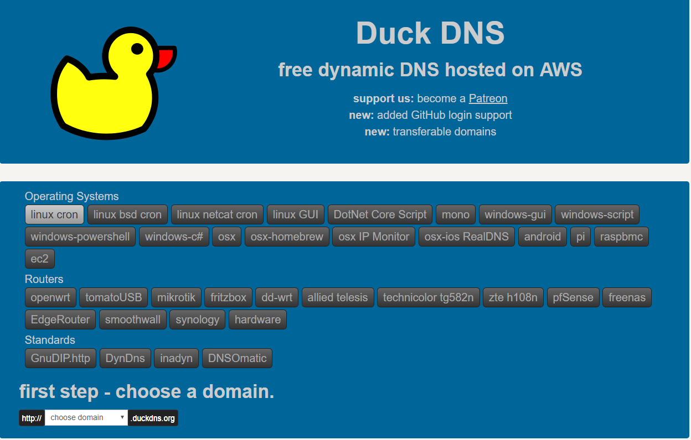
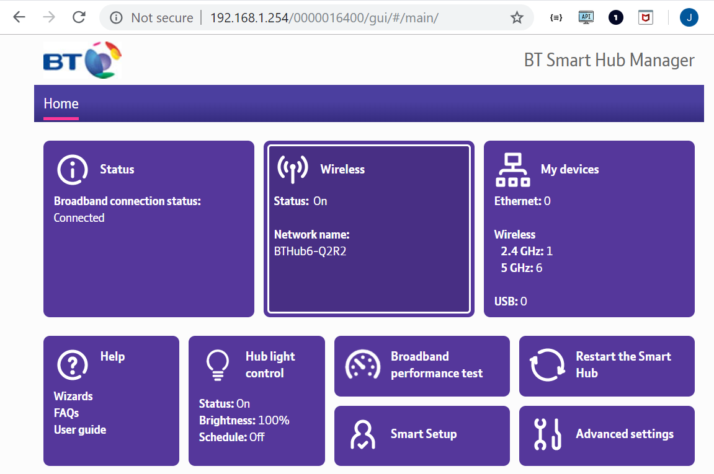

# Expose your local device to the Internet

**To connect a device to those outside of your local network, you need to expose it to the Internet. A common reason to expose your local device to the Internet is to connect an IOTA node to neighbors.**

To expose your local device to the Internet, you must forward ports from your router to your device. By doing so, any connections to your router's IP address on those ports will be forwarded to your device.

Before you can create port forwarding rules, you need a static IP address both on your local network and the Internet. If you already have these, [go straight to port forwarding](#create-a-port-forwarding-rule).

## Get a static IP address on your local network

On many private networks, whenever a new device connects to it, the device is assigned a new internal IP address from a DHCP (dynamic host configuration protocol) server, which is usually a router.

To avoid changing port forwarding rules, you need the internal IP address of your local device to stay the same. Otherwise, you'd need to update your port forwarding rules every time your IP address were to change.

### Prerequisites

To complete this guide, you must have a Linux Ubuntu 18.04 server. If you don't have a Linux server and you're running a Windows or Mac operating system, you can [run one in a virtual machine](../how-to-guides/set-up-virtual-machine.md).

---

:::info:
You can get a static IP on your local network in many ways. This guide is just one way of doing so.
:::

1. Find your gateway IP address (router's IP address) and make a note of it

    ```bash
    route -n
    ```

2. Find both the current internal IP address of your Linux server and the netmask length, and make a note of them

    ```bash
    ifconfig | grep netmask
    ```

    :::info:
    In the output, the internal IP address is next to `inet`. Ignore the 127.0.0.1 IP address, this is your localhost. For the netmask, 255 represents 8 bits. Therefore the netmask length in this example is 3*8, which results in a length of 24.
    :::

3. Open the network configuration file

    ```bash
    sudo nano /etc/netplan/01-netcfg.yaml
    ```

4. Copy and paste the following into the file. Replace the value of the `gateway4` field to your gateway IP address. In the `addresses` field, replace the value on the left of the forward slash (/) with the internal IP address of your Linux server and replace the value on the right with the netmask length.

    ```yaml
    # This file describes the network interfaces available on your system
    # For more information, see netplan(5).
    network:
    version: 2
    renderer: networkd
    ethernets:
        ens33:
        dhcp4: no
        dhcp6: no
        addresses: [192.168.1.77/24]
        gateway4: 192.168.1.1
        nameservers:
            addresses: [1.1.1.1,8.8.8.8]
    ```
    
5. Apply your changes

    ```bash
    sudo netplan apply
    ```

    :::warning:
    If your network configuration changes, for example you change your router, you may lose connection to your device. In this case, you should physically connect to your device and update the 01-netcfg.yaml file with a new static IP address.
    :::

## Get a domain name for your router

To allow external devices to connect to your device through the Internet, your router needs a static IP address on the Internet. Unfortunately, Internet service providers often give your router a dynamic IP address, which changes at regular intervals. As a result, any connections to your device will be lost when its IP address changes. Therefore, you need to use a dynamic DNS (DDNS) service to get a public domain name that is linked to your dynamic IP address. With a DDNS, your device will report the actual public IP to the DDNS server every few minutes, so it can update its records for your domain name.

:::info:
In this task, we use Duck DNS, but you can choose to use any other DDNS services.
:::

1. [Create a Duck DNS account](https://www.duckdns.org/) and add a subdomain

    

2. [Install the scripts](https://www.duckdns.org/install.jsp) that will send your IP address to Duck DNS at regular intervals. Make sure you select the correct operating system for your device and select your subdomain from the dropdown. Then, follow the instructions.

    

Now that your router has a static IP address, you can create port forwarding rules to forward connections to your device.

## Create a port forwarding rule

To expose a local device to the Internet, you must create port forwarding rules, which forward requests from certain ports of your router's IP address to your local device's internal IP address.

### Prerequisites

To complete this guide, you need the following:

- Administrator access to your router
- A [static IP address on your local network](#get-a-static-ip-address-on-your-local-network).
- A static IP address for your router, or if it has a dynamic IP address, a [domain name from a dynamic DNS service](#get-a-domain-name-for-your-router)

---

All routers are different. In this tutorial, the router is a BT Hub 6, as a result the steps in this tutorial may be different for your router, but the concepts are the same. 

1. In a web browser, enter the IP address of your router. This IP address should be displayed on your router. If you can't see it, find it in the command-line interface. You'll see your router's IP address under the `Gateway` column.

    ```bash
    route -n
    ```

2. Go to **Advanced settings**

    

3. Click **Firewall**

    

4. Create a new rule by doing the following:

    * Enter any name for your rule
    * Select your local device from the dropdown
    * Enter a port that you want to use to connect to your local device from the Internet
    * Select a protocol that the router should listen to

    

5. You may need to restart your router for the rules to take effect

6. Test your rules by checking that the port is open on your public IP address. To test your rules, you could use an online tool such as [yougetsignal.com](https://www.yougetsignal.com/tools/open-ports/).