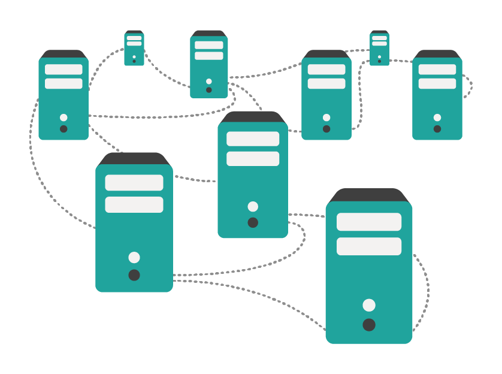

# IOTA networks

**IOTA has two public networks of [nodes](../network/nodes.md), and each one has its own [Tangle](../network/the-tangle.md) to which nodes can attach [transactions](../transactions/transactions.md).**

IOTA has the following public networks:

- **Mainnet:** IOTA token

- **Devnet:** Devnet token (free)

## Mainnet

The Mainnet is the IOTA network that uses the [IOTA tokens](../clients/token.md), which are traded on cryptocurrency exchanges.

Production applications use this network after they have tested IOTA on the [Devnet](#devnet) or a [private Tangle](root://compass/0.1/introduction/overview.md).

:::info:
Cryptocurrency exchanges sell IOTA tokens in units of Mega IOTA (1,000,000), which is also written as MIOTA or Mi.
:::



### Minimum weight magnitude

Transactions on the Mainnet must use a [minimum weight magnitude](root://getting-started/0.1/transactions/proof-of-work.md#minimum-weight-magnitude) (MWM) of 14 to be valid.

### Coordinator address

Nodes on the Mainnet are all hard-coded with the following address for the [Coordinator](../network/the-coordinator.md):

```
EQSAUZXULTTYZCLNJNTXQTQHOMOFZERHTCGTXOLTVAHKSA9OGAZDEKECURBRIXIJWNPFCQIOVFVVXJVD9
```

### Nodes

It's best practice to run your own node to have direct access to the Tangle, instead of relying on third-party nodes to receive your transactions.

However, if you want to test the Mainnet, you can find a list of nodes on community websites such as the following:

- [iota.dance](https://iota.dance/)

- [thetangle.org](https://thetangle.org/nodes)

## Devnet

The Devnet is similar to the Mainnet, except the tokens are free and it takes less time and computational power to create and send a transaction.

On this network, you can test your applications and build proofs of concept that use free Devnet tokens.


### Minimum weight magnitude

Transactions on the Devnet must use a [minimum weight magnitude](root://getting-started/0.1/transactions/proof-of-work.md#minimum-weight-magnitude) (MWM) of 9 to be valid.

### Coordinator address

Nodes on the Devnet are all hard-coded with the following address for the [Coordinator](../network/the-coordinator.md):

```
EQQFCZBIHRHWPXKMTOLMYUYPCN9XLMJPYZVFJSAY9FQHCCLWTOLLUGKKMXYFDBOOYFBLBI9WUEILGECYM
```

### Nodes

The IOTA Foundation hosts the following nodes that you can use to connect to the Devnet:

#### Load balancer node

This endpoint gives you access to a high-availability proxy server, which is running a node on the Devnet.

Use the load balancer for sending transactions and requesting information about the ledger from the node.

**URL:** https://nodes.devnet.iota.org:443

#### ZMQ node

This endpoint gives you access to the zero message queue of a node on the Devnet.

Use the ZMQ node to listen for live transaction on the Tangle.

**URL:** tcp://zmq.devnet.iota.org:5556

#### PoW node

This endpoint gives you access to a node that can do remote proof of work.

Use the PoW node to save power on small devices.

**URL:** https://powbox.devnet.iota.org

## Advice for choosing an IOTA network

When choosing a minimum weight magnitude, you should consider the following questions.

### Do you want to send test transactions that transfer IOTA tokens?

When testing IOTA in a development environment, you should consider connecting to a node on the [Devnet](root://getting-started/0.1/network/iota-networks.md#devnet). This IOTA network requires less [proof of work](root://getting-started/0.1/transactions/proof-of-work.md), which reduces the time it takes to create transactions, and it uses [free test IOTA tokens](root://getting-started/0.1/tutorials/get-test-tokens.md).

### Do you want to control the performance of the network?

When testing IOTA, you may want more control over the performance of an IOTA network and/or who has access to the Tangle. In this case, you can run a [private Tangle](root://compass/0.1/introduction/overview.md).

### Do you want to use the valuable IOTA token?

When deploying your application in a production environment, you should connect to a node on the [Mainnet](root://getting-started/0.1/network/iota-networks.md#mainnet). This network uses the IOTA token that's traded on cryptocurrency exchanges.

### Should you use a third-party node?

Connecting to third-party nodes is convenient, but comes at a disadvantage if you need a reliable service. For example:

- Your transactions will compete with other transactions that the node receives and will be processed with a priority that the node decides
- You might be requested to pay for fast PoW computation or to provide a transaction that includes PoW
- A copy of your transactions might be kept only for a limited time that's decided by the node
- A permanode option (permanent storage of your transactions) might require a fee

To overcome these disadvantages, we recommend that you run your own node and connect your application to it for direct access to the Tangle. Your own node gives you more control on how fast your transactions are attached to the Tangle and allows you to store them permanently.

A public IOTA network is one that anyone can join and use. All transactions in a public IOTA network are transparent, and anyone can see them and the balances of all addresses by connecting to a node.

## Related guides

[Connect to a node in JavaScript](root://client-libraries/1.0/getting-started/js-quickstart.md).