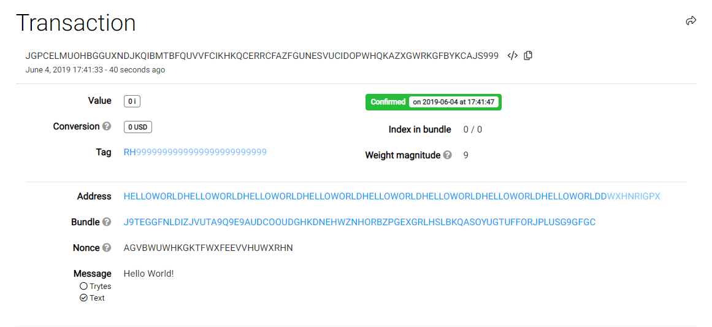

# Send your first message to the Tangle (Node.js)

**IOTA allows you to send data (zero-value) transactions as well as IOTA tokens. These zero-value transactions are useful for applications that want to send and store immutable messages on the Tangle. To send only a zero-value [transaction](../introduction/what-is-a-transaction.md), you don't need any IOTA tokens.**

To send any transaction, you must connect to a node, create a bundle, then send that bundle to it.

## Prerequisites

To complete this tutorial, you need the following:

* Node.js 8, or Node.js 10 or higher. We recommend the [latest LTS](https://nodejs.org/en/download/).
* A code editor such as [Visual Studio Code](https://code.visualstudio.com/Download)
* Access to a command prompt
* An Internet connection

## Step 1. Attach an immutable message to the Tangle

In this example, we connect to a [Devnet node](../references/iota-networks.md#devnet). The Devnet is similar to the Mainnet, except the tokens are free. Any transactions that you send to the Devnet do not exist on other networks such as the Mainnet.

1. In the command prompt, create a working directory called `iota-example`

    ```bash
    mkdir iota-example
    ```

2. Change into the `iota-example` directory and install the `core` and `converter` IOTA client libraries

    ```bash
    cd iota-example
    npm install @iota/core @iota/converter --save
    ```

    If everything went well, you should see something like the following in the output. You can ignore any 'npm WARN' messages.

    ```shell
    + @iota/converter@1.0.0-beta.8
    + @iota/core@1.0.0-beta.8
    added 19 packages from 10 contributors and audited 68 packages in 5.307s
    found 0 vulnerabilities
    ```

    You now have a `package.json` file and a `node_modules` directory, which contains the IOTA client libraries and their dependencies.

3. In the `iota-example` directory, create a new file called `data-transaction.js`

4. Require the IOTA client libraries

    ```js
    // Require the IOTA libraries
    const Iota = require('@iota/core');
    const Converter = require('@iota/converter');
    ```

5. Connect to a node

    ```js
    // Create a new instance of the IOTA object
    // Use the `provider` field to specify which IRI node to connect to
    const iota = Iota.composeAPI({
    provider: 'https://nodes.devnet.iota.org:443'
    });
    ```

6. Create a variable to store the address to which you want to send a message

    ```js
    const address =
    'HELLOWORLDHELLOWORLDHELLOWORLDHELLOWORLDHELLOWORLDHELLOWORLDHELLOWORLDHELLOWORLDD';
    ```

    :::info:
    You aren't sending any IOTA tokens, so this address does not have to belong to anyone. To be valid, the address just needs to consist of 81 [trytes](root://iota-basics/0.1/concepts/trinary.md).
    :::

7. Create a variable to store your seed

    ```js
    const seed =
    'PUEOTSEITFEVEWCWBTSIZM9NKRGJEIMXTULBACGFRQK9IMGICLBKW9TTEVSDQMGWKBXPVCBMMCXWMNPDX';
    ```

    :::info:
    This seed doesn't have to contain any addresses with IOTA tokens. If you enter a seed that consists of less than 81 characters, the library will append 9s to the end of it to make 81 characters.
    :::

8. Create a message that you want to send to the address and convert it to trytes

    ```js
    const message = Converter.asciiToTrytes('Hello World!');
    ```

    :::info:
    IOTA networks accept only [tryte-encoded](root://iota-basics/0.1/concepts/trinary.md) messages.
    :::

    :::info:
    The `asciiToTrytes()` method supports only [basic ASCII characters](https://en.wikipedia.org/wiki/ASCII#Printable_characters). As a result, diacritical marks such as accents and umlauts aren't supported and result in an `INVALID_ASCII_CHARS` error.
    :::

9. Create a transfer object that specifies the amount of IOTA tokens you want to send, the message that you want to send, and the address to send it to

    ```js
    const transfers = [
    {
        value: 0,
        address: address,
        message: message
    }
    ];
    ```

10. To construct a [bundle](../introduction/what-is-a-bundle.md) from your `transfers` object, pass it to the [`prepareTransfers()`](https://github.com/iotaledger/iota.js/blob/next/api_reference.md#module_core.prepareTransfers) method. Then, pass the returned bundle trytes to the `sendTrytes()` method to do [tip selection](root://the-tangle/0.1/concepts/tip-selection.md), [proof of work](root://the-tangle/0.1/concepts/proof-of-work.md), and send the bundle to the [node](../introduction/what-is-a-node.md)

    ```js
    iota.prepareTransfers(seed, transfers)
        .then(trytes => {
            return iota.sendTrytes(trytes, 3/*depth*/, 9/*minimum weight magnitude*/)
        })
        .then(bundle => {
        console.log(`Bundle: ${JSON.stringify(bundle, null, 1)}`)
    })
    .catch(err => {
            // Catch any errors
        console.log(err);
    });
    ```

    :::info:Depth
    The `depth` argument affects tip selection. The greater the depth, the farther back in the Tangle the weighted random walk starts.
    :::
    
    :::info:Minimum weight magnitude
    The [`minimum weight magnitude`](root://iota-basics/0.1/concepts/minimum-weight-magnitude.md) (MWM) argument affects the difficulty of proof of work (PoW). The greater the MWM, the more difficult the PoW.
    
    Every IOTA network enforces its own MWM. On the Devnet, the MWM is 9. But, on the Mainnet the MWM is 14. If you use a MWM that's too small, your transactions won't be valid and will never be confirmed.
    :::

:::success:Congratulations :tada:
You've just sent your first zero-value transaction. Your transaction is attached to [the Tangle](../introduction/what-is-the-tangle.md), which makes your message immutable.
:::

In the console, you'll see information about the the [bundle](../introduction/what-is-a-bundle.md) that you sent.

The transaction in your bundle will propagate through the network until all the nodes have it in their ledgers.

## Step 2. Confirm that your transaction is on the network

To confirm that your transaction is on the network (attached to the Tangle), copy the value of the `bundle` field from the console, open a [Devnet Tangle explorer](https://devnet.thetangle.org/), and paste the value into the search bar.

You'll see your message in the Message field.



:::info:
You can also see the Parent transactions field to check which transactions your transaction is attached to in the Tangle.

These transactions were chosen during tip selection and added to the [`branchTransaction` and `trunkTransaction` fields](root://iota-basics/0.1/references/structure-of-a-transaction.md) of your transaction.
:::

## Run the code

Click the green button to run the sample code in this tutorial and see the results in the web browser.

<iframe height="600px" width="100%" src="https://repl.it/@jake91/51-Send-ASCII-Data?lite=true" scrolling="no" frameborder="no" allowtransparency="true" allowfullscreen="true" sandbox="allow-forms allow-pointer-lock allow-popups allow-same-origin allow-scripts allow-modals"></iframe>

:::info:
[Learn what these transaction fields mean](root://iota-basics/0.1/references/structure-of-a-transaction.md).

Messages are stored in the `signatureMessageFragment` field.
:::

## Next steps

[Send some test IOTA tokens](../tutorials/send-iota-tokens.md)

[Send a bundle of two zero-value transactions](root://iota-basics/0.1/how-to-guides/send-bundle.md) to learn how bundles are structured.

[Run your own node in a Docker container](../tutorials/run-your-own-iri-node.md) for direct access to the Tangle without relying on third parties.
