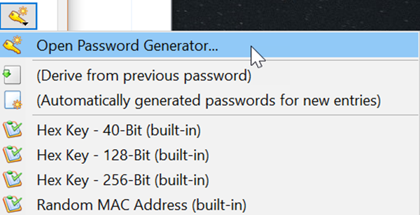

# Create a seed

**The most important attribute to consider when creating a new seed is randomness. The more random your seed, the more secure it is. In this tutorial, you create a random seed.**

Seeds are the master key to your public keys, addresses, and their private keys. Anyone with your seed can withdraw IOTA tokens from your addresses or impersonate you by signing messages with your private keys. 

:::info:
The total number of possible seeds is almost unlimited (8.7 x 10<sup>115</sup>). As a result, the chances of two seeds being the same is very unlikely.
:::

The following examples are ways of creating a seed with enough randomness, to make it secure.

- Use the command line
- Use the KeePass password manager

:::info:
You can also create a seed directly in the Trinity wallet. See [Create an account](root://wallets/0.1/trinity/how-to-guides/create-an-account.md) in the Trinity documentation.
:::

## Use the command line

Command-line interfaces, such as PowerShell in Windows, the Linux Terminal or Terminal for macOS, offer tools for generating random characters for seeds.

--------------------
### Linux
1\. Do the following in a command-line interface:

```bash
cat /dev/urandom |tr -dc A-Z9|head -c${1:-81}
```

2\. Copy and paste your seed into a file and store it in a safe place
---
### macOS
1\. Do the following in a command-line interface:

```bash
cat /dev/urandom |LC_ALL=C tr -dc 'A-Z9' | fold -w 81 | head -n 1
```

2\. Copy and paste your seed into a file and store it in a safe place
---
### Windows Powershell
1\. Do the following in Powershell:

```bash
$b=[byte[]] (1..81);(new-object Security.Cryptography.RNGCryptoServiceProvider).GetBytes($b);-join($b|%{[char[]] (65..90+57..57)[$_%27]})
```

2\. Copy and paste your seed into a file and store it in a safe place
--------------------

## Use KeePass

KeePass is a password manager that stores passwords in encrypted databases, which can be unlocked with one master password or key file.

These steps are for Windows, but you can also use KeePass on Linux or macOS.

1. [Download the KeePass installer](https://keepass.info/)

2. Open the installer and follow the on-screen instructions

3. Open KeePass and click **New**

    

4. After you've followed the instructions and saved the KeePass file on your computer, right click the empty space and click **Add entry**

    

5. Click **Generate a password**

    

6. Select only the following options and click **OK**:

- Length of generated password: 81
- Upper-case (A, B, C, ...)
- Also include the following characters: 9
    
7\. Click **OK** to save your seed

## Next steps

It's important to store and back up your seed in a safe place. If you lose your seed, you can't recover it. See [Storing your seed](../clients/storing-a-seed.md).
