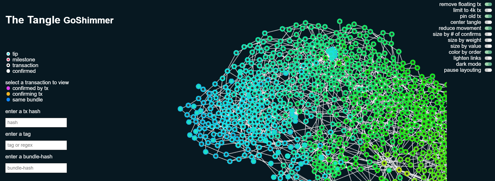

# Install GoShimmer from the pre-built executable

**In this tutorial, you run a node on your native filesystem, using the pre-built executable file on the GoShimmer GitHub repository.**

## Prerequisites

To run a node, you need the following:

- [Git](https://git-scm.com/downloads)
- Ports 14626(TCP/UDP) and 14666 (TCP) forwarded to the device that will run the node
- A public IP address

---

1. Go to the [GoShimmer release page](https://github.com/iotaledger/goshimmer/releases)

2. Download the GoShimmer file for your operating system  

3. Use one of the following commands to execute the pre-built `goshimmer` file, depending on your operating system:

    ```bash
    # Linux and macOS
    ./goshimmer --node.enablePlugins "spammer","graph"
    # Windows
    .\goshimmer --node.enablePlugins "spammer","graph"
    ```

    :::info:
    You can run the file with the `-h` or `--help` flag to see a list of all configuration options.
    :::

:::success:Congratulations :tada:
You're now running a GoShimmer node.
:::


The status screen displays the following statistics in the top-right corner:

- **TPS:** The number of transactions per second, which are separated into two categories. The **received** transactions are those that the node has just appended to its ledger. The **new** transactions are solid transactions.
- **Node ID:** The node's public key that gives it a unique identity
- **Neighbors:** The number of neighbors that the node is connected to. All nodes can have a maximum of 8 neighbors. Each node chooses 4 neighbors to connect to and accepts incoming connections from 4 other neighbors that chose it.
- **Known peers:** The total number of nodes in the network. At the moment, the number of **neighborhood** nodes is the same as the number of **total** nodes. When the network allows sharding, the **neighborhood** nodes will be those that are in the node's shard.
- **Uptime:** The total amount of time during which the node has been running

:::info:
If you don't have any accepted neighbors, make sure that you've forwarded your `autopeering` TCP/UDP port (14626) to your device.
:::

## Next steps

Now that your node is running, you can [send it spam transactions](../tutorials/send-spam.md) to test how many transactions per second your node can process.

To see the transactions in the GoShimmer network's Tangle, open the visualizer by going to `http://127.0.0.1:8082` in a web browser.

