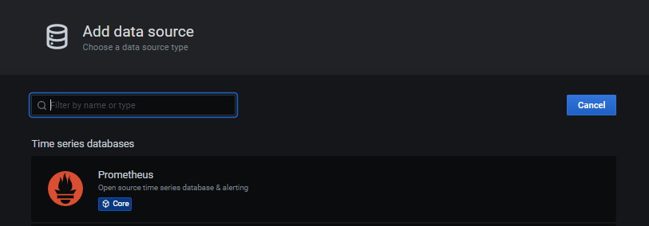
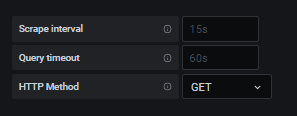
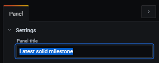

# Set up a Grafana dashboard

**In this tutorial, you set up a Grafana dashboard to monitor your node locally. The dashboard will display a graph of the solid milestone indexes from the last 30 minutes.**

## Prerequisites

To complete this tutorial, you need a Hornet node that's running on a Linux operating system.

For tutorials, see [Choose an installation method](../tutorials/install-hornet.md). After installing your node, make a note of where your `config.json` file is. You'll need it in this tutorial.

## Step 1. Enable the plugin

In this step, you enable the `Prometheus` plugin on your Hornet node to expose its metrics.

1. Open your `config.json` file
    
    The location of this file depends on how you installed Hornet.

2. Enable the plugin

	```bash
	"node":{
    "alias": "My first node",
    "showAliasInGetNodeInfo": false,
    "disablePlugins": [],
    "enablePlugins": ["Prometheus"]
	},
	```

3. Restart Hornet

4. In a web browser, go to http://localhost:9311/metrics

You should see something like the following:

```
# HELP iota_data_sizes_bytes Data sizes in bytes.
# TYPE iota_data_sizes_bytes gauge
iota_data_sizes_bytes{name="database"} 5.688745984e+09
# HELP iota_info_app Node software name and version.
# TYPE iota_info_app gauge
iota_info_app{name="HORNET",version="0.4.0-rc13-7c7c2d1"} 1
# HELP iota_info_latest_milestone Latest milestone.
```

This data includes the metrics that Hornet is now exposing. You'll use this later to configure a panel on your dashboard.

## Step 2. Run a Prometheus server

In this step, you install and run a Prometheus server and configure it to scrape data from the `Prometheus` plugin on your Hornet node.

1. Download the latest stable release of Prometheus. Replace the `$VERSION` placeholder with the current latest version of Prometheus. See [Downloads](https://prometheus.io/download/) in the Prometheus documentation.

    ```bash
    wget https://github.com/prometheus/prometheus/releases/download/v$VERSION/prometheus-$VERSION.linux-amd64.tar.gz
    ```

2. Extract the files

    ```bash
    tar xvfz prometheus-*.tar.gz
    cd prometheus-*
    ```

3. Open the `prometheus.yml` file and configure the server to scrape data from your Hornet node

    ```yaml
    - job_name: Hornet
        scrape_interval: 5s
        scrape_timeout: 5s
        static_configs:
        - targets: ['localhost:9311']
    ```

4. Run the server

    ```bash
    /prometheus --config.file=prometheus.yml
    ```

    You should see something like the following:

    ```bash
    level=info ts=2020-06-05T11:37:27.122Z caller=main.go:646 msg="Server is ready to receive web requests."
    ```

5. In a web browser, go to localhost:9090 to open your server's user interface

6. Go to **Status** > **Targets**

You should see that your server is running and scraping data from Hornet.


## Step 3. Connect Grafana to your Prometheus server

In this step, you install Grafana and connect it to your Prometheus server. This way, you can use Grafana to display the data in graphs.

1. Download and install Grafana. For instructions, see [Install on Debian or Ubuntu](https://grafana.com/docs/grafana/latest/installation/debian/) in the Grafana documentation.

2. In a web browser, go to http://localhost:3000/datasources/new, and click **Prometheus**

    

3. In the HTTP section of the Settings page, add the localhost URL of your Prometheus server and select **Browser** from the Access dropdown

    

4. From the HTTP Method dropdown, select **GET**

    

Now, you're ready to configure your dashboard's panels to start displaying the metrics.

## Step 4. Configure a panel on your dashboard

In this step, you configure a Grafana panel on your dashboard to display your Hornet node's latest solid milestone index.

1. In Grafana, go to **Create** > **Dashboard**, and click **Add new panel**

2. In the Metrics field, enter `iota_info_latest_solid_milestone_index` to display a time series graph of your node's latest solid milestone index

    

3. In the Time range dropdown, select **Last 30 minutes**

    

4. Enter a name for your panel such as Latest solid milestone

    

5. In the top right-hand corner, click **Apply**

You should see your panel displayed on your dashboard.


:::success: Congratulations! :tada:
You now have a Grafana dashboard that you can use to monitor your node.
:::

## Next steps

Grafana allows you to customize your dashboard with many panels. You can even set up alerts when certain conditions are met. See the [Grafana documentation](https://grafana.com/docs/grafana/latest/?osource=grafana_gettingstarted) for more information.

At the moment, you can access your Grafana dashboard only from the device that's running the Prometheus server. If you want to access the Grafana dashboard from any device, open port 9090 and edit the Grafana settings to connect to your public IP address instead of localhost.