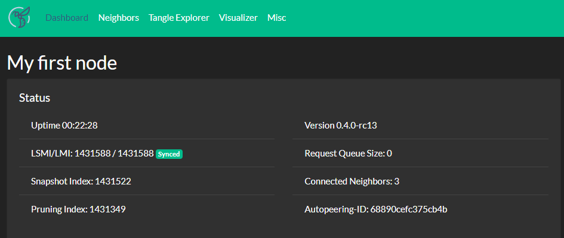

# Setting up your dashboard

**Hornet nodes come with a default dashboard for monitoring data such as uptime, synchronization status, and transactions. This topic walks you through setting up and customizing the dashboard.**

## Customizing your dashboard

If you want to name your node and have it displayed in the dashboard, add your chosen name to the `node.alias` field in your configuration file.

```json
"node": {
    "alias": "My first node",
    "showAliasInGetNodeInfo": false,
    "disablePlugins": [],
    "enablePlugins": []
  },
```



You can also name your fixed neighbors by adding their names to the `peers.alias` field in your `peering.json` file.

```json
"peers": [
    {
      "identity": "example.neighbor.com:15600",
      "alias": "Example Peer",
    }
```

## Exposing your dashboard to the Internet

By default, the dashboard is hosted on a website on port 8081 and available only to the localhost, meaning that you must use the same device that's running Hornet to view it.

Opening the dashboard to the Internet allows anyone with your node's IP address or domain name to access it.

Before exposing your dashboard to the Internet, we recommend setting up basic authentication.

Basic authentication is a method for authorizing access to your node's dashboard, using a username and password.

You can set up basic authentication for your node's dashboard, using the `dashboard` object.

```json
"dashboard": {
    "bindAddress": "localhost:8081",
    "theme": "default",
    "dev": false,
    "basicAuth": {
      "enabled": false,
      "username": "",
      "passwordHash": "",
      "passwordSalt": ""
    }
}
```

By default, basic authentiation is disabled. To enable it, you need to provide a username a salt, and the SHA256 hash of your password with the salt appended. This way, the password is never stored on your node, making it more secure.

For example, for the password `iota` and the salt `mysecretsalt`, the SHA256 hash of `iotamysecretsalt` is `6d2c5b160faf1603fc21df32597f2bfdf30a5cf87e44e41bd6160547214bad6e`.

In this case, the `dashboard` object would look like this:

```json
"dashboard": {
    "bindAddress": "localhost:8081",
    "theme": "default",
    "dev": false,
    "basicAuth": {
      "enabled": false,
      "username": "user",
      "passwordHash":"6d2c5b160faf1603fc21df32597f2bfdf30a5cf87e44e41bd6160547214bad6e",
      "passwordSalt": "mysecretsalt"
    }
}
```

Now, to log into the dashboard, you need to enter the correct username and password.

You can expose your dashboard to the Internet by changing the `dashboard.bindAddress` field, and opening port 8081 on your device. For more information on opening ports, see [How to Open Ports](https://www.wikihow.com/Open-Ports) on wikiHow.

```json
"dashboard": {
    "bindAddress": "0.0.0.0:8081",
```

