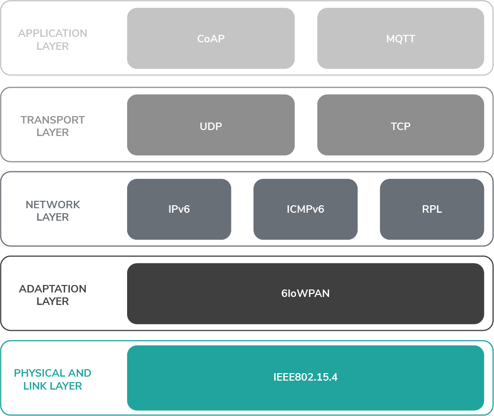

# 6LoWPAN

**6LoWPAN is a networking system that combines the latest version of the Internet Protocol (IPv6) and Low-power Wireless Personal Area Networks (LoWPAN). 6LoWPAN, allows small devices with limited processing ability to transmit information wirelessly using an internet protocol for a variety of applications including wireless sensor networks.**

All devices in the Internet of Things must be uniquely identifiable, so that direct communication between the devices is possible and each device can be individually addressed. One way of accomplishing this is to assign a unique IPv6 address to each device and handle all communication through IPv6.

This SDK provides means to use BLE links to connect IoT devices to a BLE-enabled router, which in turn is connected to the Internet through IPv6. All IoT devices are assigned individual IPv6 addresses, and the BLE link is used to transmit the IPv6 packages.

Each IoT device can directly communicate with other devices using their IPv6 address; no matter if the other device is connected to the same router or is located somewhere else on the Internet, and no matter if the other device is using a BLE link or not. In addition, all applications can use the same protocol (for example MQTT, CoAP, or even HTTP) to communicate, which means that heterogeneous types of devices - wired, wireless, or clouds - can communicate in a common language.

### 6LoWPAN

To conform to the IEEE 802.15.4 protocol, which allows for a packet size of up to 127 bytes, 6LoWPAN uses header compression to reduce the size of local IPv6 addresses from 1280 bytes.

The 6LoWPAN layer uses transparent packet fragmentation to combine the IEEE 802.15.4 packets.

[IEEE 802.15.4](https://standards.ieee.org/standard/802_15_4-2015.html) is the PHY and MAC layer for the 6LoWPAN network. 

The Direct Sequence Spread Spectrum modulation used in IEEE 802.15.4 
interferes less with other protocol on the same frequency.

The standard is defined in the following documents:
[RFC 8025](https://datatracker.ietf.org/doc/rfc8025/), 
[RFC 6775](https://datatracker.ietf.org/doc/rfc6775/), 
[RFC 6282](https://datatracker.ietf.org/doc/rfc6282/), 
[RFC 8066](https://datatracker.ietf.org/doc/rfc8066/)

### 6LoWPAN over Bluetooth Low Energy

The 6LoWPAN over Bluetooth Low Energy protocol uses 6LoWPAN techniques to enable IPv6 packets over Bluetooth Low Energy. The standard is described in [RFC7668](https://datatracker.ietf.org/doc/rfc7668/), which uses the 
[IPSP characteristics](https://www.bluetooth.org/docman/handlers/DownloadDoc.ashx?doc_id=296307) in Bluetooth >= 4.1.

The complete IP standard for Bluetooth is defined in the [Bluetooth 4.2 specification](https://www.bluetooth.org/DocMan/handlers/DownloadDoc.ashx?doc_id=286439).

## Network topologies

6LoWPAN includes two types of network topologies: Star and mesh tree.

### Star

The star topology is the simplest form of network topology. In the star topology,all devices directly communicate with the border router, which acts as a switch to pass on their messages.

|**Advantages**|**Disadvantages**|
|:---------|:------------|
|A single device failure does not affect the entire network|More cables are required because each computer connects to the border router|
|Easy to extend|The border router is a single point of failure|
|Fast data transfer|

### Mesh tree

A mesh tree topology is a network topology in which all the network nodes are connected to most of the other nodes. In this topology, no switch acts as a central point of communication to pass on the messages. Instead, messages are routed through the network.

|**Advantages**|**Disadvantages**|
|:---------|:------------|
|Easy to diagnose a faulty device|Can be difficult to add more devices to the network|
|Secure and private connections|

## Naming conventions

The following naming conventions are used to describe 6LoWPAN networks.

### LLN

LLN stands for low power and lossy networks.

In this type of network, devices may not always be available. For example, some devices may be set up to be available only during certain intervals.

### Host

Host describes a device which is not a router. In a mesh tree the host is a leaf node.

### Node

Node refers to any device in the network structure. This can either be a host or a router. 

### RPL (IPv6 Routing Protocol for Low-Power and Lossy Networks)

RPL is the routing protocol that's used for 6LoWPAN.

The standard is defined in [RFC 6550](https://datatracker.ietf.org/doc/rfc6550/).

[This video series](https://www.youtube.com/watch?v=6AP7p0sbBro&t=45s) is a good resource for understanding the details of this protocol.

#### Types of router

A 6LoWPAN network can have two types of router.

#### 6LoWPAN border router

Border routers (sometimes known as edge routers) connect the 6LoWPAN with an IPv6 network.

The border router connects the network to either the Internet or a private network.

#### 6LoWPAN router

A 6LoWPAN router routes the packets to hosts or other routers. The only difference between a router and a border router is that the border router is connected to the Internet.

