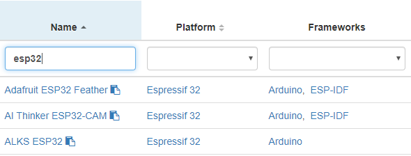

# Get started with IOTA on PlatformIO

**PlatformIO is an ecosystem and development platform for embedded devices that comes with lots of tools for the most common integrated development environments (IDEs). In this guide, you set up PlatformIO and use it to compile, upload, and run an example IOTA application on your device.**

## Hardware

To complete this guide you need the following:
- An ESP32 or STM32F7 device that is supported by Arduino
- A Linux, macOS, or Windows operating system

In this guide, we use the Arduino framework because it is simple for beginners. However, PlatformIO supports other frameworks such as [mbed OS](https://www.mbed.com/en/platform/mbed-os/) and [Zephyr OS](https://www.zephyrproject.org/), which offer more flexibility and advanced functionality. If you want to use one of these other frameworks, see our [examples](#example-applications).

To check if your device is supported by Arduino, [search for it on the PlatformIO website](https://platformio.org/boards), and make sure that the Frameworks column includes Arduino.



## Step 1. Set up a development environment

In this step, you install the necessary tools to start developing applications with PlatformIO.

1. Install [Visual Studio Code](https://code.visualstudio.com/)

    We use Visual Studio Code in this guide because it's free and [open source](https://github.com/Microsoft/vscode)

2. Install the [PlatformIO extension](https://marketplace.visualstudio.com/items?itemName=platformio.platformio-ide) for Visual Studio Code

3. Open Visual Studio Code and [create your project](https://docs.platformio.org/en/latest/integration/ide/vscode.html#setting-up-the-project).

4. Give your project a name, select `Arduino` as the framework, and select the board you are going to use

If you don't use Visual Studio Code, make sure to [follow the documentation](https://docs.platformio.org/en/latest/integration/ide/index.html) for your IDE before you start following the guide.

## Step 2. Add IOTA as a dependency to your project

In this step, you add the [IOTA C client library](https://github.com/iotaledger/iota.c) to your project.

1. Open the `platformio.ini` file and add the following below the `; https://docs.platformio.org/page/projectconf.html` line:

    ```
    [external_libs]
    lib_deps_external =
        https://github.com/oopsmonk/iota_common.git#pio_lib
        https://github.com/troydhanson/uthash.git#1124f0a70b0714886402c3c0df03d037e3c4d57a
        https://github.com/oopsmonk/XKCP.git#pio_keccakp1600
    ```

2. Below the `framework = arduino` line, add the following:

    ```
    build_flags =
        -I${PROJECT_LIBDEPS_DIR}/${PIOENV}/Keccak/lib/common
        -I${PROJECT_LIBDEPS_DIR}/${PIOENV}/Keccak/lib/high/Keccak
        -I${PROJECT_LIBDEPS_DIR}/${PIOENV}/Keccak/lib/high/Keccak/FIPS202
        -I${PROJECT_LIBDEPS_DIR}/${PIOENV}/Keccak/lib/low/KeccakP-1600/Reference

    ; Library options
    lib_deps =
        ${external_libs.lib_deps_external}
    ```

Your `platformio.ini` file should look similar to the following:

```
[external_libs]
lib_deps_external =
    https://github.com/oopsmonk/iota_common.git#pio_lib
    https://github.com/troydhanson/uthash.git#1124f0a70b0714886402c3c0df03d037e3c4d57a
    https://github.com/oopsmonk/XKCP.git#pio_keccakp1600

[env:esp32dev]
platform = espressif32
board = esp32dev
framework = arduino

build_flags =
    -I${PROJECT_LIBDEPS_DIR}/${PIOENV}/Keccak/lib/common
    -I${PROJECT_LIBDEPS_DIR}/${PIOENV}/Keccak/lib/high/Keccak
    -I${PROJECT_LIBDEPS_DIR}/${PIOENV}/Keccak/lib/high/Keccak/FIPS202
    -I${PROJECT_LIBDEPS_DIR}/${PIOENV}/Keccak/lib/low/KeccakP-1600/Reference

; Library options
lib_deps =
    ${external_libs.lib_deps_external}
```

## Step 3. Test PlatformIO

In this step, you compile, upload, and run a sample program, using PlatformIO.

1. Plug your device into your computer's USB port

    PlatformIO tries to automatically detect any connected devices. If PlatformIO does not recognize your device, see the [`upload_port` option](https://docs.platformio.org/en/latest/projectconf/section_env_upload.html?utm_source=platformio&utm_medium=piohome#upload-port).

2. Go to the `src` directory of your project, and open the `main.cpp` file

    This file includes the `setup()` and `loop()` functions, which are native to the Arduino IDE.

3. Replace the code in the `main.cpp` file with the following:

    ```cpp 
    void setup()
    {
        Serial.begin(9600);
    }

    void loop()
    {
        Serial.println("Hello world!");
        delay(1000);
    }
    ```

    If you already have an application written in the Arduino IDE, you can copy and paste it in this file instead.

4. [Compile and upload](https://docs.platformio.org/en/latest/integration/ide/vscode.html#setting-up-the-project) the code to your device

    

5. Click the **PlatformIO: Serial Monitor** button on the bottom bar to connect to your device's serial terminal and see the output

    

## Step 4. Run the example IOTA application

In this step, you run an example IOTA application that generates an address.

1. Go to [GitHub](https://github.com/iota-community/iota_c_platformIO/blob/arduino_esp32/src/main.cpp) and copy the contents of the `main.cpp` file to your clipboard

2. Open your `src/main.cpp` file and paste the copied content into it

3. [Compile and upload](https://docs.platformio.org/en/latest/integration/ide/vscode.html#setting-up-the-project) the code to your device

4. Click the **PlatformIO: Serial Monitor** button on the bottom bar to connect to your device's serial terminal and see the output

You should see the default seed, followed by an address.

## Next steps

Try our example applications for the following frameworks:

- [mbedOS](https://github.com/iota-community/iota_c_platformIO/blob/mbed_stm32f746zg/src/my_app.cpp)
- [ESP-IDF (freeRTOS)](https://github.com/iota-community/iota_c_platformIO/tree/esp_idf_esp32/src)

Use the [IOTA C client library's API](https://github.com/iotaledger/iota.c#api-reference) to expand the examples with your own ideas.


