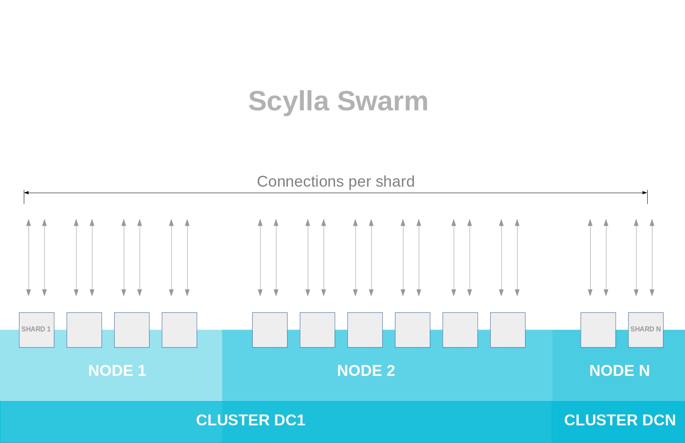
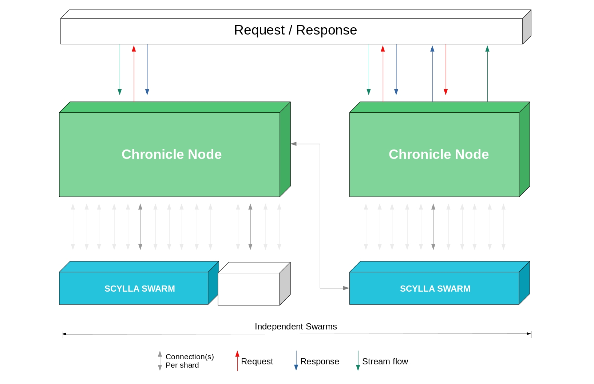

# Chronicle overview

**Chronicle is a permanode solution that allows you to store all transactions that reach an [IRI node](root://node-software/0.1/iri/introduction/overview.md) in a distributed database that scales well and has many security options.**

## What is a permanode?

A permanode stores the full history of Tangle and enables high-demand applications to find the data through an extended API.

## Why run a Chronicle?

IOTA is a permissionless network. Anyone can store any amount of data on the Tangle for free (just a small amount of proof of work per transaction).

Over time, the ledger of an IRI node accumulates many transactions, which often cause it to become larger than the node's available memory. To stop the ledger from becoming too large, these nodes often do local snapshots that prune transactions.

For many business use cases, data in the IOTA Tangle needs to be stored for long periods of time. For example, financial data must be stored for 10 years in some cases, and identity data needs to be kept for the lifetime of the identity.

Chronicle makes it easy for node owners to store all the IOTA transactions in a secure, scalable, and distributed Scylla database.

:::info:
Chronicle will be ported to Rust to align with the future strategy of the IOTA technology stack.
:::

Chronicle communicates with IRI nodes through the `tx_trytes` [ZMQ event](root://node-software/0.1/iri/references/zmq-events.md) to receive information about the transactions in their ledgers . When Chronicle receives transactions, it processes them through the umbrella project, then it stores them in the Scylla database.

:::info:
[Ready to run Chronicle](../how-to-guides/get-started.md)?
:::

## Chronicle architecture

Currently, one Chronicle node manages and supervises all the shards in the Scylla swarm. It does this by establishing at least one connection per shard. All the connections are independent, and are supervised by the core app in the umbrella project.
In this diagram, the Chronicle node consists of the green components between the IRI node and the Scylla Swarm. The node contains the umbrella project, API services, the core app, the ZMQ messenger, and the explorer service.

#### Umbrella project

An Umbrella project is a space where independent apps coexist and communicate through Inter-Process Communication (IPC). Each app runs under its own supervision tree, which allows it to grow and easily migrate to its own rack (a cluster with its own umbrella project).

To allow Chronicle to scale up, it uses Elixir [umbrella projects](https://elixir-lang.org/getting-started/mix-otp/dependencies-and-umbrella-projects.html#umbrella-projects) to split code into multiple apps and arrange them under an umbrella project.

The Chronicle umbrella project includes a core app that communicates with the Scylla swarm to do the following:
* Manage database changes
* Forward the changes to the swarm
* Monitor cluster supervisors

Other apps use the core app to communicate with the Scylla swarm through IPC. These apps can hold the business rules that need to interact with the core app.

Apps take turns to run by using a preemptive scheduling process that's based on a round-robin algorithm.

#### Core app

The Chronicle core app may be an independent microservice or it may be dependent on other apps. For example, a Chronicle app may depend on the shared core app to access the Tangle.

#### Scylla swarm

The Scylla swarm is shown in blue. The Scylla swarm stores transaction data for Chronicle.

## How Chronicle works

Chronicle has apps that are built in [Elixir/Erlang](https://elixir-lang.org/) because this framework can process a very high volume of data with minimal delay.

Elixir provides web development tools and embedded software development tools plus a network that can be extended by building microservices.

When the apps process the data, it's stored in a [ScyllaDB](https://www.scylladb.com/) database. ScyllaDB takes care of the big data concerns such as partitioning, replication, in-memory processing, and consistency. It stores transaction data quickly and keeps track of shards of distinct groups of data.

When you send a data request to a Chronicle, it requests the data from the ScyllaDB, then formats and returns you the response.

## How ScyllaDB works

[ScyllaDB](https://docs.scylladb.com/using-scylla/) is a real-time, big data database featuring high throughput and low-latency. To achieve this, ScyllaDB optimizes the physical location of the database and the logical location of the data.

### Physical location of the database

A Scylla database may be physically located on multiple computers in multiple datacenters. To accomplish this, build one Scylla node by installing ScyllaDB on one computer. Next, build more nodes to create a Scylla cluster. These nodes do not share memory or hard-drive space. They share their state via the Gossip protocol. Finally, add Scylla clusters to a Scylla swarm. Visualize a swarm as a ring of clusters. Scylla swarms can be located in one or more datacenters. Now, you have a distributed database.

:::info:
Take a look at the [Scylla documentation](https://university.scylladb.com/setup-a-scylla-cluster/) for help with clusters.
:::

### Logical location of the data

Data is stored across multiple nodes on multiple computers. To achieve this, data is organized into rows and columns in a table. To create a table, you define each column and the type of data it can hold. You also define the [primary key, the partition key, and the clustering key](http://sudotutorials.com/tutorials/cassandra/cassandra-primary-key-cluster-key-partition-key.html). Then you add rows.

The primary key is a unique identifier for each row in a table. A partition key indicates which node will hold a row of data. Clustering keys sort data in a partition. In a Scylla table, columns are ordered by the clustering key. Using these three keys, Scylla can locate data quickly. 

Storing and retrieving data is faster when the data is organized into distinct collections, called shards. Use partitions to create shards. A Scylla partition is a logical storage unit that holds the rows identified by a partition key. A shard is a group of data with the same partition key. 

To ensure reliability and fault tolerance, Scylla stores data replicas on multiple nodes. These nodes are called replica nodes. Partitions are repeated on replica nodes. You can set the number of replicas by setting the replication factor (RF).

Here is a diagram showing how data flows through Chronicle:

## Next steps

[Run Chronicle](../how-to-guides/get-started.md) to get started with storing transactions.
