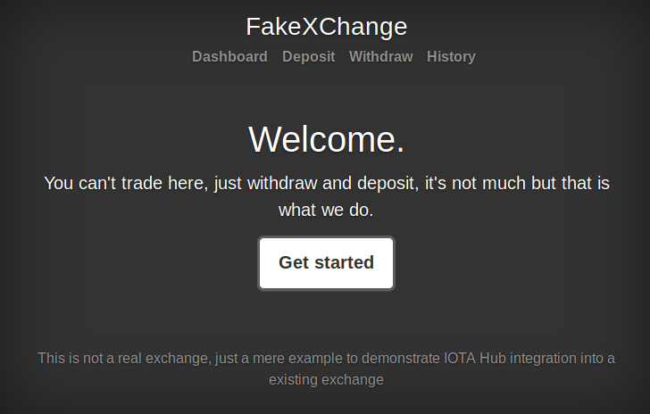
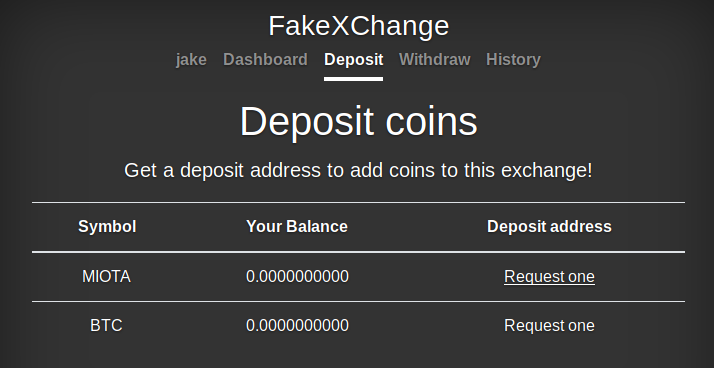
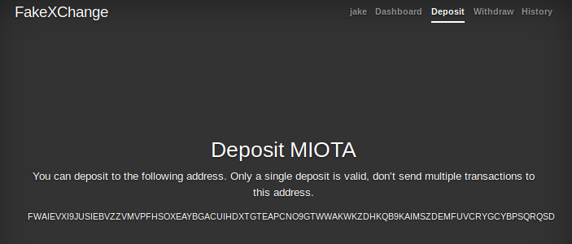
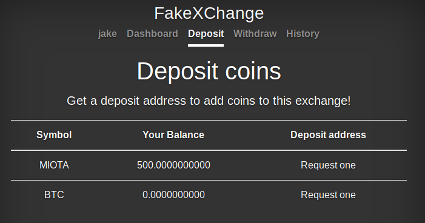
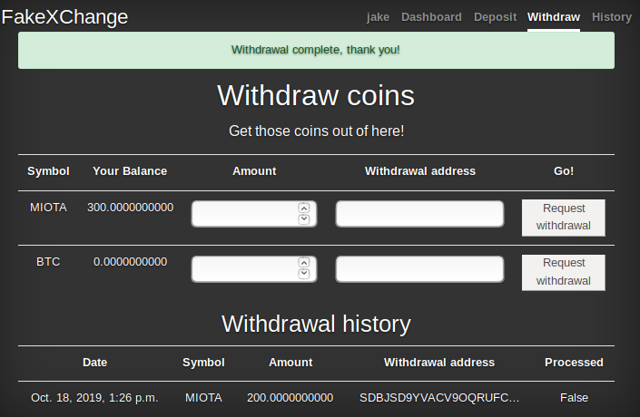

# Create a demo exchange

**To help you understand how Hub can be integrated into an application, this guide walks you through the process of making Hub API calls on the server side of a fake exchange. At the end of this guide, you will have a demo exchange into which you can deposit IOTA tokens and then withdraw them.**

You can integrate Hub into an application in many ways. This guide uses integration option 2, which is the easiest way to store all users' IOTA tokens outside of Hub.

For details about Hub integration options, see the [integrations guide](../how-to-guides/integrate-hub.md).

The [source code for this guide](https://github.com/fijter/fakexchange) is available on GitHub. The `master` branch is the one without the Hub integration.

To complement this guide, we created this video tutorial, which guides you through the process of setting up Hub and the demo exchange.

<iframe width="560" height="315" src="https://www.youtube.com/embed/O2ukIXqJTls" frameborder="0" allow="accelerometer; autoplay; encrypted-media; gyroscope; picture-in-picture" allowfullscreen></iframe>

## Prerequisites

To complete this guide, you need the following:

- An instance of Hub that's connected to a Devnet node and that has an exposed RESTful API server
- A Linux [Ubuntu 18.04 LTS](https://www.ubuntu.com/download/server) server. If you are on a Windows or Mac operating system, you can [create a Linux server in a virtual machine](root://general/0.1/how-to-guides/set-up-virtual-machine.md).

## Step 1. Set up the exchange server

Before you can start integrating Hub into the demo exchange, you need to set it up to run as a server on your device.

1. Install Python 3

    ```bash
    sudo apt-get install -y python3-all
    ```

2. If your Linux distribution has Python 2 pre-installed, make sure that it uses Python 3 by default

    ```bash
    echo "alias python=python3" >> ~/.bashrc
    ```

3. Install the `python-dev` package

	```bash
	sudo apt-get install python-dev
	```

4. Download the demo exchange code from GitHub

	```bash
	cd ~
	git clone https://github.com/fijter/fakexchange.git \
	cd fakexchange
	```

5. To avoid installing the dependencies in your global Python environment, create a virtual environment

	```bash
	sudo apt-add-repository multiverse && sudo apt update
	sudo apt install -y python3-venv
	python3 -m venv env
	```

6. Activate the virtual environment in a shell session

	```bash
	. env/bin/activate
	```

	:::info:
	To exit the virtual environment, use the `deactivate` command.
	:::

7. Install the dependencies

	```bash
	pip install -r requirements.txt
	```

8. Prepare the database

	```bash
	python manage.py migrate
	```

9. Load the exchange rate data

	``` 
	python manage.py loaddata coins
	```

10.   Run the server

	```
	python manage.py runserver
	```

When the server starts, you should see something like the following:

```

Watching for file changes with StatReloader
Performing system checks...

System check identified no issues (0 silenced).
October 15, 2019 - 14:08:42
Django version 2.2.4, using settings 'exchange.settings'
Starting development server at http://127.0.0.1:8000/
Quit the server with CONTROL-C.
```

Now that the exchange server is running, go to a web browser and visit 127.0.0.1:8000 to see the user interface for the demo exchange.



## Step 2. Create an exchange user account

Before you can deposit and withdraw IOTA tokens, you need a user account on the exchange.

1. If the exchange server is still running, press **Ctrl**+**C** to stop it

2. Create a super user and enter your credentials when prompted

    ```bash
    python manage.py createsuperuser
    ```

3. Start the server

    ```bash
    python manage.py runserver
    ```

4. Go to the admin page at 127.0.0.1:8000/admin and enter your user credentials to log in

5. Click **Deposit**

    

    This page shows the balance of your account.

6. In the MIOTA row, click **Request one** to request a new IOTA deposit address into which you can deposit tokens

You'll see that this feature isn't available yet. 

## Step 3. Integrate deposit addresses

At the moment, the exchange doesn't allow you to deposit or withdraw IOTA tokens. To add this functionality, you can make calls to the Hub RESTful API endpoints.

Each time users wants to deposit IOTA tokens, it's best practice to create a new deposit address for them, using the [`GetDepositAddress`](../references/restful-api-reference.md#GetDepositAddress) endpoint.

1. In the `exchange` directory, create an `iota.py` file

    ```bash
    cd exchange
    sudo nano iota.py
    ```

2. In this file, create a template for sending API calls to Hub. Replace the `'http://127.0.0.1:8888'` URL with value of the `--listenAddress` flag that you used when you set up Hub. This is the URL on which Hub listens for API requests.

	```py
	import requests
	import datetime

	class IOTA(object):

		def __init__(self):
			self.api_address = 'http://127.0.0.1:8888'

		def request(self, payload):
			headers = {'Content-Type': 'application/json', 'X-IOTA-API-Version': '1'}
			response = requests.post(self.api_address, json=payload, headers=headers)
			
			print(payload)

			if not response.ok:
				raise ValueError('Invalid response', '%s: %s' % (response.status_code, response))

			return response.json()
	```

3. Create a function that creates a new Hub user by calling the [`CreateUser`](../references/restful-api-reference.md#CreateUser) endpoint

    ```py
    def create_user(self, user_id):
        ret = self.request({'command': 'CreateUser', 'userId': 'user-%s' % user_id})
        if 'error' in ret:
            return False
        else:
            return True
    ```

4. Create a function that returns a new deposit address for the given Hub user by calling the [`GetDepositAddress`](../references/restful-api-reference.md#GetDepositAddress) endpoint

    ```py
    def get_deposit_address(self, user_id):
        self.create_user(user_id)
        ret = self.request({'command': 'GetDepositAddress', 'userId': 'user-%s' % user_id})
        if 'address' in ret:
            return ret['address']

        return False
	```

    If the Hub user doesn't exist, this function creates a new one. Otherwise, this call tries and fails because Hub can't create users with duplicate user IDs.

5. Save the file

6. Open an interactive shell session

    ```py
    python manage.py shell
    ```

7. Call the `get_deposit_address()` function to make sure that it's working

    ```bash
    >>> from exchange.iota import IOTA
    >>> api = IOTA()
    >>> api.get_deposit_address('000')
    ```

    You should see an IOTA address in the console. This is the user's deposit address.

    ```bash
    {'command': 'CreateUser', 'userId': 'user-000'}
    {'command': 'GetDepositAddress', 'userId': 'user-000'}
    'GACPCTSIYHK9XXNZUEHGAQEZUCDKJTSH9SMYYIIPYQZSERWZQDNIIUASYTCG9OQJENWSKIWLOELNOYWRC'
    >>>
    ```

    :::info:
    If you see a 'Connection refused' error, make sure that Hub is running and that you entered the correct Hub API URL in step 2.
    :::

8. Exit the shell session by pressing **Ctrl**+**D**, and open the `models.py` file in the 'users' directory

    ```bash
    nano users/models.py
    ```

9. Find the `deposit_address()` function and replace its contents with the following:

    ```py
    '''
    Returns a new deposit address for our given symbol
    '''

    if symbol in ('IOTA', 'MIOTA'):
        from exchange.iota import IOTA
        api = IOTA()
        addr = api.get_deposit_address(self.id)
        if not addr:
            return 'Unable to generate'
        else:
            return addr
    
    if symbol == 'BTC':
        return '1CFBdvaiZgZPTZERqnezAtDQJuGHKoHSzg'
    ```

10.  Save the file and run the server again

Now, when you click **Deposit** > **Request one** in the user interface, a new deposit address should appear.



To deposit IOTA tokens into your exchange account, you can send IOTA tokens to this address. But, the exchange will not recognize your updated balance yet.

## Step 4. Monitor user accounts for balance changes

At the moment, if you send IOTA tokens to the deposit address, the balance in the user's exchange account doesn't update.

To make sure this balance is kept up to date, you can monitor Hub user addresses for balance changes, using the [`BalanceSubscription`](../references/restful-api-reference.md#BalanceSubscription) endpoint

1. In the `exchange` directory, open the `models.py` file

    ```bash
    cd exchange
    nano models.py
    ```

2. In the `Coin` class, under the `price_in_usd` variable, add a new variable to contain the last time the user balances were updated

    ```py
    last_hub_check = models.DateTimeField(null=True, blank=True)
    ```

3. Save the file, then in the `iota.py` file, create a function that subscribes to balance changes by calling the [`BalanceSubscription`](../references/restful-api-reference.md#BalanceSubscription) endpoint

    ```py
    def get_balance_changes(self, since=None):
        if since:
            since = since.strftime('%s000')
        else:
            since = 0

        ret = self.request({'command': 'BalanceSubscription', 'newerThan': since})
        return ret
    ```

4. Create two more functions: One to get active users and another to get their balances

    ```py
    def active_users(self, since=None):
        balance_changes = self.get_balance_changes(since=since)
        active_users = set()
        for event in balance_changes.values():
            u = event.get('userId')
            if u:
                active_users.add(u)
        return active_users

    def get_active_balances(self, since=None):
        users = self.active_users(since=since)
        ubalance = {}
        for user in users:
            ubalance[user] = self.check_balance(user.split('-', 1)[1])

        return ubalance
    ```

5. In the `exchange/management` directory, create a new directory called `commands` and change into it

    ```bash
    cd exchange/management
    mkdir commands
    cd commands
    ```

6. Create a new file called `check_changes.py` and add the following to it:

    ```py
    from django.core.management.base import BaseCommand, CommandError
    from django.utils import timezone
    from exchange.iota import IOTA
    from exchange.models import Coin, WithdrawalsRequest
    from user.models import User

    class Command(BaseCommand):

        help = "Check if there's anything in Hub that needs to be processed"

        def handle(self, *args, **options):

            api = IOTA()
            coin = Coin.objects.by_symbol('MIOTA')
            since = coin.last_hub_check

            print(since)

            data = api.get_active_balances(since)

            if data:
                print(data)
                for user_id, balance in data.items():
                    user = User.objects.get(id=user_id.split('-')[1])
                    user.alter_balance('MIOTA', int(balance), modification_type='DEPOSIT')
                    print("Gave %d iota to user %s after deposit" % (int(balance), user_id))
            coin.last_hub_check = timezone.now()
            coin.save()
    ```

7. Load the new `last_hub_check` field into the database

    ```bash
    python manage.py makemigrations
    python manage.py migrate
    ```

8. Start the server, and request a new deposit address

9. Use the Devnet faucet to [send some test IOTA tokens to your deposit address](root://core/1.0/tutorials/js/transfer-iota-tokens.md)

    :::info:
    In the guide, replace the `receivingAddress` variable with your deposit address.
    :::

10.  Wait for 5 minutes to give the transaction time to be confirmed, then call the `check_changes` command

    ```bash
    python manage.py check_changes
    ```

In the console, you should see a deposit event for the user. 

```bash
2019-10-18 09:34:35.587317+00:00
{'command': 'BalanceSubscription', 'newerThan': '1571391275000'}
{'command': 'CreateUser', 'userId': 'user-1'}
{'command': 'GetBalance', 'userId': 'user-1'}
{'user-1': '500'}
Gave 500 iota to user user-1 after deposit
```

If you run the server again and go to **Deposit**, you should see an updated balance.



This balance is taken from Hub and saved in the exchange database.

:::info:
To make sure that Hub regularly checks for changes, you can call this command in a cron job that runs every minute. This way user balances are always automatically kept up to date.
:::

## Step 5. Create a Hub user as a hot wallet

To store the tokens in a cold wallet (an offline wallet), you can create a normal Hub user and transfer all IOTA tokens to that user when a balance change event occurs.

1. In the `iota.py` file, create a function to update the Hub database so that all incoming deposits are added to the exchange owner's `hot-wallet` user

    ```py
    def batch_to_exchange(self, batch):
        self.create_user('hot-wallet')
        newbatch = []
        to_exchange = 0

        for user_id, amount in batch.items():
            newbatch.append({'userId': user_id, 'amount': 0-int(amount)})
            to_exchange += int(amount)

        newbatch.append({'userId': 'user-hot-wallet', 'amount': to_exchange})

        ret = self.request({'command': 'ProcessTransferBatch', 'transfers': newbatch})
        
        if not 'error' in ret:
            return True
        else:
            print(ret['error'])
            return False
    ```

    This function calls the [`ProcessTransferBatch`](../references/restful-api-reference.md#ProcessTransferBatch) endpoint, which updates the Hub database. This way, the `hot-wallet` user has access to all users' IOTA tokens, allowing the exchange to withdraw them from Hub into a cold wallet for storage.

    :::warning:Warning
    When you transfer tokens outside of Hub, you're at risk of not having enough funds to be able to process withdrawal requests.
    :::

2. Save the file and open the `check_changes.py` file

    ```bash
    sudo nano exchange/management/commands/check_changes.py
    ```

3. In the `if data` statement, call the `batch_to_exchange()` function to transfer any user deposits to the hot wallet

    ```py
    if data and api.batch_to_exchange(data):
    ```

4. Save the file

Now, whenever users makes a deposit, their balance will be updated on the exchange, and in the Hub database, that balance will be transferred to the `hot-wallet` user.

## Step 6. Integrate withdrawals

To withdraw IOTA tokens from their accounts, users need to request a withdrawal from Hub.

1. In the `iota.py` file, create a function to withdraw IOTA tokens, using the `UserWithdraw` endpoint 

    ```py
    def withdraw(self, user_id, amount, address, validate_checksum=True, tag='FAKEXCHANGE'):
        self.create_user(user_id)
        ret = self.request({
            'command': 'UserWithdraw', 
            'userId': 'user-%s' % user_id, 
            'amount': amount,
            'payoutAddress': address,
            'validateChecksum': validate_checksum,
            'tag': tag
        })
        
        if 'uuid' in ret:
            return ret['uuid']
        else:
            return False
    ```

2. Save the file and open the `check_changes.py` file

    ```bash
    sudo nano exchange/management/commands/check_changes.py
    ``` 

3. Add the following:

    ```py
    for wr in WithdrawalRequest.objects.filter(processed=False, coin=coin):
            status = api.withdraw('hot-wallet', int(wr.amount), wr.address, validate_checksum=True, tag='FAKEXCHANGE')

            if not status:
                print("Failed to withdraw")
                wr.failed = True
                wr.save()
            else:
                wr.processed = True
                wr.processed_at = timezone.now()
                wr.comment = status
                wr.save()
    ```

    This code iterates through any user withdrawal requests and actions them from the hot user account.

Now, if you request another deposit address and send IOTA tokens to it, you can withdraw those token by going to **Withdraw** and completing the fields.



## Next steps

Continue to improve this demo integration by adding more functionality. For example, you might want to check


