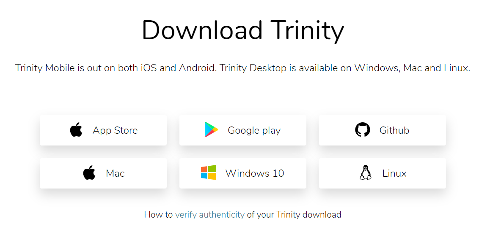
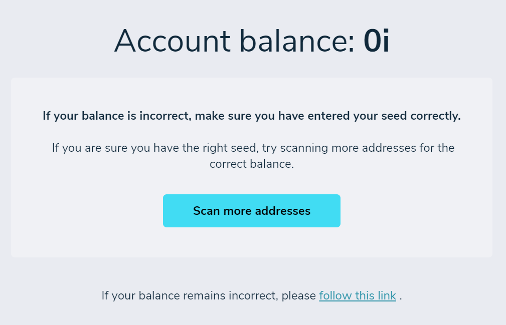
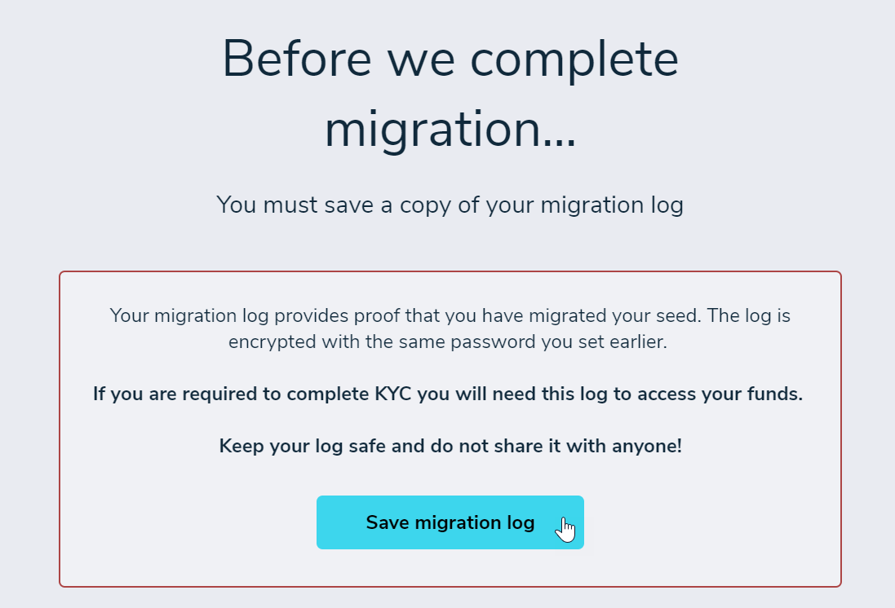
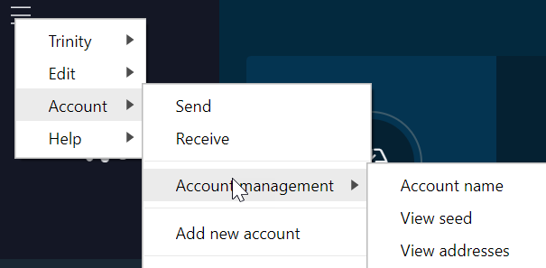

# Protect your Trinity account

**Between 17 December 2019 and 17 February 2020, some users’ Trinity seeds and Trinity passwords were compromised during an attack on the wallet. In this guide, you learn what you can do to secure your IOTA tokens.**

To stop attackers from further transferring IOTA tokens, the IOTA Foundation paused the Coordinator and released an updated version of Trinity. This version is no longer vulnerable to the attack. A full report will be published shortly.

While the [Coordinator](root://getting-started/0.1/network/the-coordinator.md) is paused, no one can transfer their IOTA tokens on the Mainnet.

To help you to secure your IOTA tokens before the Coordinator is restarted, the IOTA Foundation built the Seed Migration tool. This tool takes your existing Trinity seed and transfers all your IOTA tokens to a secure, randomly generated one.

Depending on when and how you used the Trinity wallet, you may need to take steps to protect your Trinity account.

**Read the headings below and follow the instructions below the one that best describes you.**

## I use Trinity with a Ledger hardware wallet

Seeds never leave the [Ledger hardware wallet](https://www.ledger.com/), therefore your seed is still safe. However, your Trinity password may have been compromised.

### What to do

[Install the latest version of Trinity and update your password](#install-the-latest-version-of-trinity).

## I use Trinity Mobile

The attack affected only Trinity Desktop, so if you use Trinity Mobile, your seed, username, and password are safe.

### What to do

Although Trinity Mobile was not affected, we recommend that you [transfer your IOTA tokens to a new seed](#transfer-your-iota-tokens-to-a-new-seed).

## I have not opened Trinity Desktop since 16 December 2019

The attack affected users who opened Trinity Desktop version 1.2.0, 1.2.1, and 1.2.2 between 17 December 2019 and 17 February 2020.

If you did not open Trinity in this timeframe, your seed, username, and password are safe.

### What to do

[Install the latest version of Trinity Desktop and update your password](#install-the-latest-version-of-trinity).

Although you were not affected, we recommend that you [transfer your IOTA tokens to a new seed](#transfer-your-iota-tokens-to-a-new-seed).

## I know that my IOTA tokens were stolen during this attack

Unfortunately, the attacker managed to steal IOTA tokens from some users' Trinity accounts.

The IOTA Foundation has notified all exchanges of these transfers to prevent any further movement of the stolen IOTA tokens.

### What to do

1. [Install the latest version of Trinity and update your password](#install-the-latest-version-of-trinity)
2. [Transfer your IOTA tokens to a new seed](#transfer-your-iota-tokens-to-a-new-seed)

When you have completed these steps, you may also need to go through the [Identity Verification Process](../references/faq.md#what-is-the-idenitity-verification-process) to reclaim your stolen IOTA tokens.

## I’m not sure

For anyone else, you should assume that your seed and Trinity password are no longer secret. Therefore, when the Coordinator is restarted, your IOTA tokens may be at risk.

### What to do

1. [Install the latest version of Trinity and update your password](#install-the-latest-version-of-trinity)
2. [Transfer your IOTA tokens to a new seed](#transfer-your-iota-tokens-to-a-new-seed)

---

## Install the latest version of Trinity

In this step, you upgrade the Trinity wallet to the latest version to remove the vulnerability.

1. [Download and install the latest version of Trinity](https://trinity.iota.org/) by clicking the **Download** button in the right-hand corner and selecting your operating system

    By installing this version, you overwrite any existing versions.

    

2. Open Trinity and go to **Trinity** > **Settings** > **Change password** to change your existing password

3. If you have used the same password for other services or websites, change those as well

:::success:
You've downloaded the latest version of Trinity.
:::

## Transfer your IOTA tokens to a new seed

In this step, you use the Seed Migration tool to transfer your IOTA tokens to a new seed.

:::info:
Due to technical limitations, only balances of over 1 Mi can be transferred to a new seed with this tool.
:::

1. [Download the Seed Migration tool] from the official IOTAledger Github repository

    Please make sure to check that the URL in the address bar is xxx

    If you are using Linux, you need to [make the downloaded file executable](https://medium.com/@peey/how-to-make-a-file-executable-in-linux-99f2070306b5).

2. Open the Seed Migration tool, and either import your existing SeedVault file or enter your seed manually

    To find your existing seed in Trinity, go to **Account** > **Account management** >  **View seed**. Here, you can export your seed to a SeedVault file or see it in plain text.

3. Make sure your displayed balance is correct

    The displayed balance is the total balance of your seed’s first 50 addresses.

    :::info:
    This is the total amount of IOTA tokens which will be transferred to your new seed.
    :::

4. If you think your balance is wrong, or you know that you have IOTA tokens on more than the first 50 addresses, click **Sync addresses**

    The tool will check the balance of 50 more addresses each time you click this button.

    

5. Choose an option to create a new seed, and follow the prompts

6. Save your migration log file

    This file contains details about the transfer to your new seed. You can use this file to check the status of your transfer, and you will need it in case you need to go through the [Identity Verification Process](../references/faq.md#what-is-the-idenitity-verification-process).

    

7. Click **Begin Transfer** to transfer all your IOTA tokens to the first address of your new seed

    The transfer can take a few minutes. If you close the window before the transfer is finished, you may need to go through the [Identity Verification Process](../references/faq.md#what-is-the-idenitity-verification-process).

    :::info:
    When your transfer is finished, it will be sent to the IOTA Foundation’s server, where it will be given priority for confirmation when the Coordinator is restarted.
    :::

    Your transfer can have one of the following statuses:

    **Secured:** The Coordinator has confirmed your transfer. You are free to send value transactions, using your new seed.

    **Submitted:** Your transfer has been sent to the IOTA Foundation's server, and now you just need to wait for the Coordinator to be restarted

    **ID Required:** Your transfer either includes stolen IOTA tokens or someone else tried to use the Seed Migration tool with your seed. Please see the [Identity Verification Process](../references/faq.md#what-is-the-idenitity-verification-process) for more information.

8. Open Trinity and [create a new account](../how-to-guides/create-an-account.md) with your new seed

    :::info:
    Until the Coordinator is restarted, your new seed’s balance will be 0. After the Coordinator is restarted, your transfers will be confirmed and you will see your correct balance.
    :::

9. To see your new seed, go to **Account** > **Account management** >  **View seed**, and enter the password you created in step 5

    

You can repeat this process for any other seeds that you may own.

:::success:
You've transferred your IOTA tokens to a new seed.
:::

## Next steps

If you have any questions, check the [FAQ](../references/faq.md) or reach out to the IOTA community in the #help channel on [Discord](https://discord.iota.org/).

If you want to use a Ledger hardware wallet, see [the guide on the official Trinity website](https://trinity.iota.org/hardware/).

