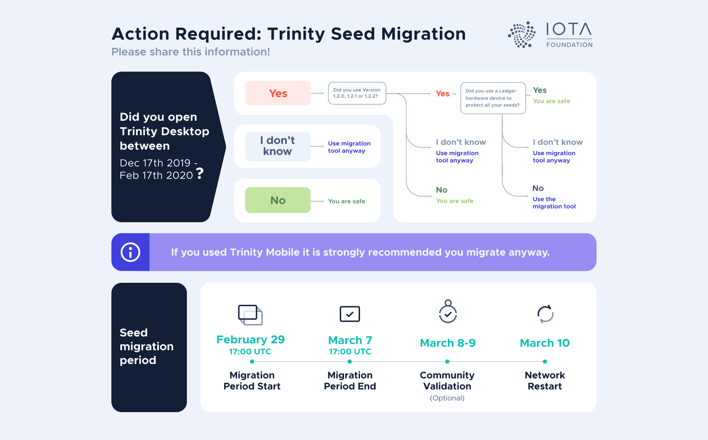

# Seed migration FAQ

**These are frequently asked questions about the recent Trinity attack and the seed migration tool.**

## What do I have to do to be safe?

Depending on when and how you used the Trinity wallet, you may need to take steps to [protect your Trinity account](../how-to-guides/protect-trinity-account.md).

## Were my IOTA tokens stolen?

If you see any value transactions that you did not send in your Trinity history, your IOTA tokens may have been stolen. Please see the Identity Verification Process.

If you don't see any value transactions in your Trinity history, but your balance is wrong, see the [Troubleshooting guide](../references/troubleshooting.md) for help or reach out to the IOTA Foundation on [Discord](https://discord.iota.org/).

:::warning:
Please be aware that some users are impersonating members of the IOTA Foundation on Discord. Therefore, it is important that you contact members directly by clicking their names in the right-hand panel under 'IOTA Foundation'.
:::

## When will the Coordinator be restarted?

The Coordinator will be restarted on 10 March 2020 to give users enough time to [protect their Trinity accounts](../how-to-guides/protect-trinity-account.md).

## The Coordinator was paused, does this mean that IOTA is centralized?

The [Coordinator](root://getting-started/0.1/network/the-coordinator.md) is a centralized finality device, which provides security during the network’s infancy.

The Coordinator will be removed when we have an implementation of all [Coordicide](https://coordicide.iota.org/) modules.

## How do I transfer my IOTA tokens?

While the [Coordinator](root://getting-started/0.1/network/the-coordinator.md) is paused, no one can transfer their IOTA tokens on the Mainnet.

We recommend reading [this guide](../how-to-guides/protect-trinity-account.md) if you want to migrate your IOTA tokens to a new seed before the Coordinator is restarted.

## Is it safe to share my addresses with others?

Yes. Addresses are public information and can be seen on Tangle explorers such as https://thetangle.org/.

:::warning:
Never share your seed or Ledger phrases with anyone.
:::

## Can the Coordinator repay the stolen IOTA tokens?

No. The [Coordinator](root://getting-started/0.1/network/the-coordinator.md) cannot transfer IOTA tokens.

However, the IOTA Foundation may consult with community node owners to discuss the option of a global snapshot.

During a global snapshot, and pending node owner validation, at-risk IOTA tokens would be transferred to a secure seed until their owners can verify their identities.

## I use the IOTA light wallet, do I have to do anything? Will it still work after the Coordinator is restarted?

The attack affected only the Trinity wallet. If you have never used Trinity, you don't need to do anything. When the Coordinator is restarted, you can use the light wallet to transfer IOTA tokens again.

## Can I migrate directly to a Ledger hardware wallet?

No. To transfer your IOTA tokens to a Ledger account, you should do the following: 

1. [Install the latest version of Trinity and update your password](../how-to-guides/protect-trinity-account.md#install-the-latest-version-of-trinity)

2. [Migrate your IOTA tokens to a new seed](../how-to-guides/protect-trinity-account.md#migrate-your-iota-tokens-to-a-new-seed)

3. From 10 March 2020, [set up a ledger account](https://trinity.iota.org/hardware/) and transfer your IOTA tokens from your new seed to the Ledger

## What can I do if I miss the seed migration period?

The migration period ends on 7 March 2020. If you did not migrate your seed before this date, we recommend [creating a new account in Trinity](../how-to-guides/create-an-account.md) and transferring your IOTA tokens to an address on your new seed either on or after 10 March 2020.
 
If you think that your IOTA tokens were stolen, reach out to the IOTA Foundation on [Discord](https://discord.iota.org/).
 
:::warning:
Please be aware that some users are impersonating members of the IOTA Foundation on Discord. Therefore, it is important that you contact members directly by clicking their names in the right-hand panel under 'IOTA Foundation'.
:::

## What happens if the attacker uses the Seed Migration Tool with a stolen seed?

If more than one person uses the Seed Migration Tool to migrate the same seed, the owner of the seed will need to go through the [Identity Verification Process](#what-is-the-idenitity-verification-process) to validate their ownership.

## What is the Identity Verification Process?

To protect at-risk IOTA tokens, the IOTA Foundation may consult with community node owners to discuss the option of a global snapshot.

During a global snapshot, and pending node owner validation, at-risk IOTA tokens would be transferred to a secure seed until their owners can verify their identities

At-risk IOTA tokens include:

- Those that are known to have been stolen during the attack
- Those that belong to a seed that was migrated by two or more people

If you own any at-risk IOTA tokens, you may need to complete a KYC (know your customer) process with a third party to reclaim them.

More information on the process as well as the consequences for all affected users will be provided soon. Please see the [status page](http://status.iota.org/) for updates.

## Will my pending transactions be confirmed when the Coordinator is restarted?

If you use the Seed Migration Tool to [migrate your IOTA tokens to a new seed](../how-to-guides/protect-trinity-account.md#migrate-your-iota-tokens-to-a-new-seed), any pending transactions that you sent before the Coordinator was paused will not be confirmed.

If you don't use the Seed Migration Tool, any pending transactions that you sent before the Coordinator was paused may still be confirmed.

