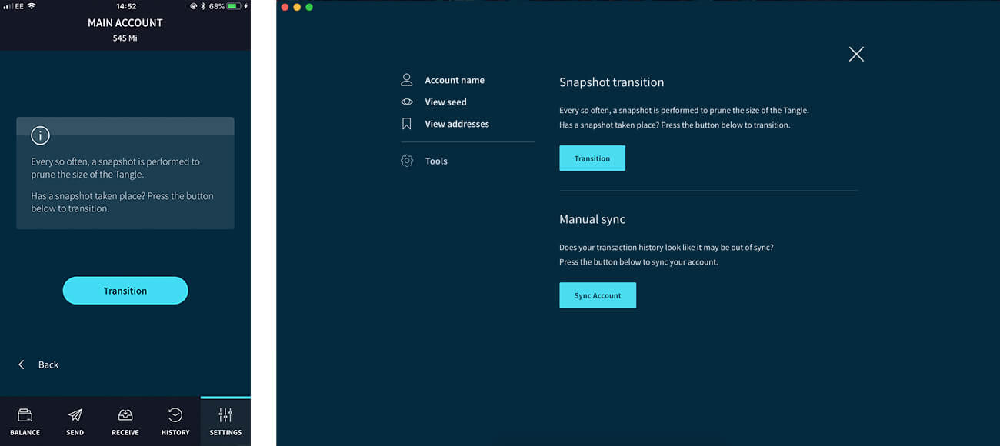

# Troubleshooting

**Use this reference guide to resolve issues related to Trinity.**

:::danger:
On 11 February 2020, the IOTA Foundation became aware of an attack on the Trinity wallet, during which some users’ seeds and Trinity passwords were compromised. Please check our advice for [protecting your Trinity account](../how-to-guides/protect-trinity-account.md).
:::

If you can't find the solution to your issue, reach out to the Trinity team on the `help` channel of the official IOTA [Discord](https://discord.iota.org/).

## Incorrect balance

Trinity regularly updates your balance by asking nodes for the balance of all addresses associated with your seed.

If Trinity can't connect to a node, it may display an incorrect balance.

To fix this problem, Trinity keeps a list of your generated addresses so that you can re-synchronize it the next time Trinity connects to a node.

If you think your balance is wrong, you can synchronize Trinity by going to **Settings** > **Account** > **Account management** > **Tools** > **Sync account**, or you can [perform a snapshot transition](../how-to-guides/perform-a-snapshot-transition.md).

 

:::info:
You can also [view the balance of individual addresses](../how-to-guides/manage-your-account.md#view-the-addresses-of-an-account).
:::

### Global snapshots

During a global snapshot, nodes remove old transaction data from their ledgers to free memory. After a global snapshot, nodes have only the addresses with a balance of at least 1 i. If you don't see your correct balance after a global snapshot, you must perform a snapshot transition to allow Trinity to request the latest balance of your addresses.

:::info:
Trinity is stateful, which means that it stores a local copy of your transaction history on your device. As a result, you can still see your transaction history after a global snapshot.
:::

1. Go to **Account** > **Account management** > **Tools**

2. Click **Transition**

## Pending transaction

If a transaction on the Tangleis pending for a long time, make sure that the [Auto-promotion setting](../how-to-guides/auto-promote.md) is set to **Enabled**.

:::info:
Auto-promotion is available on mobile devices only when Trinity is in the foreground.
:::

## Unable to send a transaction

Trinity may stop you from sending a transaction for any of the following reasons:

- If you have funds on a [spent address]root://getting-started/1.0/references/glossary.md#spent-address, Trinity stops you withdrawing from that address to protect your IOTA tokens.
- If the address you are sending to is spent, Trinity will stop you from sending to that address to protect your IOTA tokens. In this case, ask the recipient for a new address.
- If you are sending more than one transaction, you may need to wait for your first transaction to be confirmed before sending another one

## Lost access to a device

If you lose access to your device, no one can access your account without your password. To recover your account, install Trinity on another device and enter your account's seed that you backed up.

:::info:
For extra protection, create a new account and transfer your IOTA tokens to an address that belongs to that new account's seed.
:::
